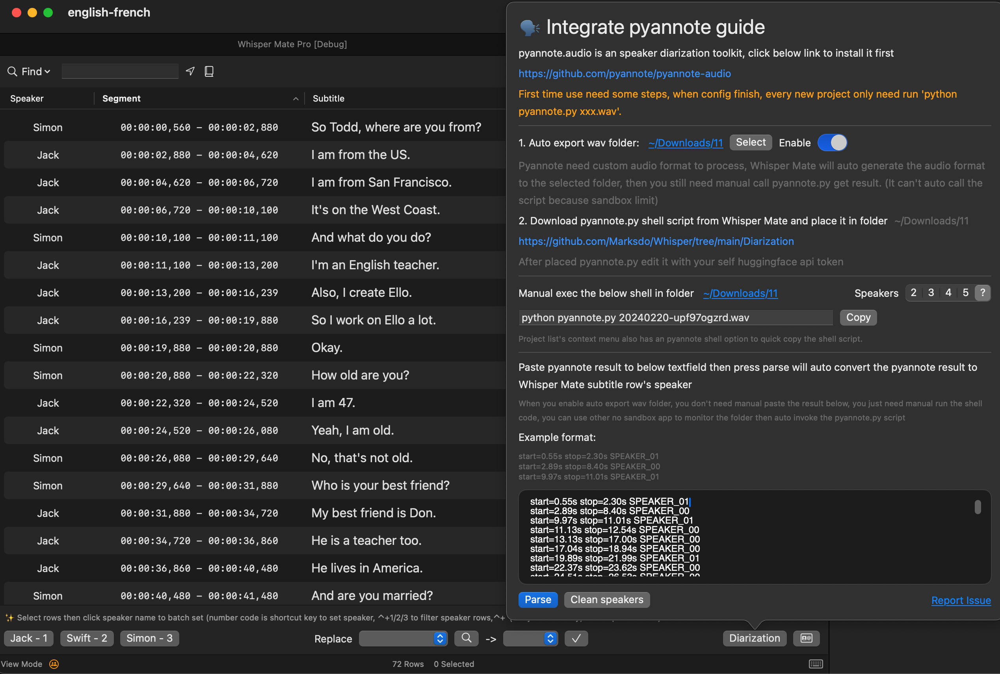
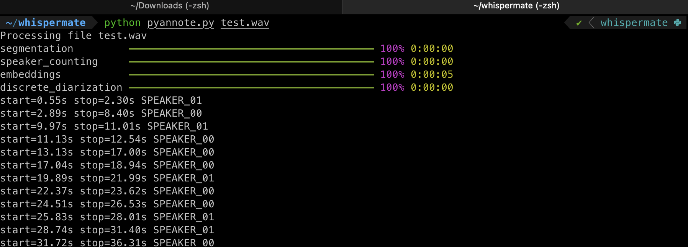
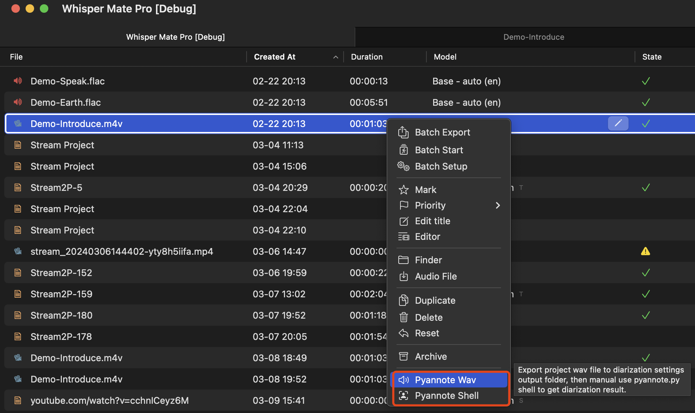
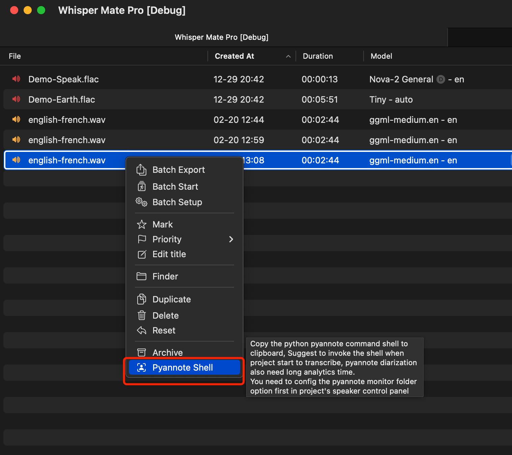
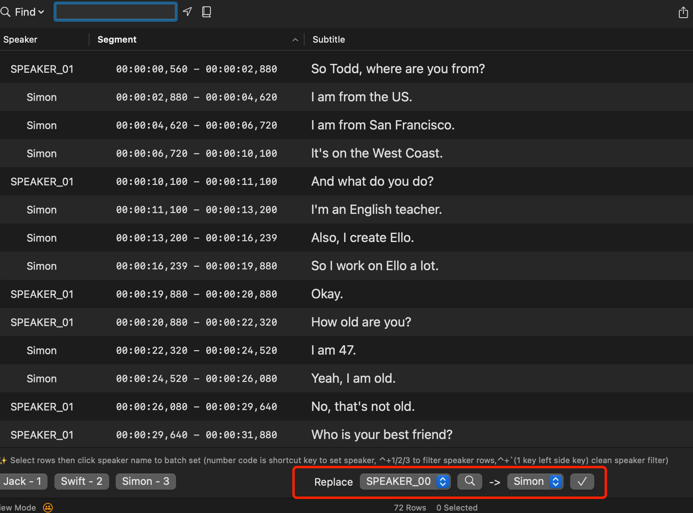

# 🗣️ Integrate Pyannote
Whisper Mate 5.5.2 start to support pyannote (https://github.com/pyannote/pyannote-audio)
Cause the macos sandbox app permission issue, You need manual do some steps to use it as diarization in Whisper Mate



# Install conda python env
You can skip installing Conda and directly install the dependencies of pyannote in your system's Python environment, but it is not recommended to do so.
> ref https://developer.apple.com/metal/pytorch/
visit https://docs.anaconda.com/free/miniconda/ to download conda install shell
if x86-64 download https://repo.anaconda.com/miniconda/Miniconda3-latest-MacOSX-x86_64.sh
if Apple M chic download https://repo.anaconda.com/miniconda/Miniconda3-latest-MacOSX-arm64.sh

open shell window
```sh
chmod +x Miniconda3-latest-MacOSX-arm64.sh
./Miniconda3-latest-MacOSX-arm64.sh

enter yes accept license and yes to insert init config code in shell
```

open new terminal tab
```sh
conda create --name whispermate python=3.11
conda activate whispermate
conda install pytorch torchvision
pip install pyannote.audio
```

# Make Whisper Mate working folder
```
cd ~
mkdir whispermate
cd whispermate
curl -o pyannote.py https://raw.githubusercontent.com/Marksdo/Whisper/main/Diarization/pyannote.py
curl -o test.wav https://raw.githubusercontent.com/Marksdo/Whisper/main/Diarization/test.wav
```

# Get your own huggingface api token
1. Accept [`pyannote/segmentation-3.0`](https://hf.co/pyannote/segmentation-3.0) user conditions
2. Accept [`pyannote/speaker-diarization-3.1`](https://hf.co/pyannote/speaker-diarization-3.1) user conditions
3. Create access token at [`hf.co/settings/tokens`](https://hf.co/settings/tokens).

edit `pyannote.py` change `use_auth_token=xxxxxxxxxxxxxxxxx` to your huggingface api token then save
if you device is not M Chip change `pipeline.to(torch.device("mps"))` to `pipeline.to(torch.device("cpu"))`

# Test pyannote running
```sh
cd ~/whispermate
python pyannote.py test.wav
```



# Connect Whiser Mate & pyannote settings
- Set an sync folder to auto export pyannote needed audio.wav file (select previous ~/whispermate folder)


if using manual strategy, use main project list's context menu to invoke output project's wav to ~/whispermate folder



# Every project manual exec
- When project added to Whisper Mate after start process, copy the shell command to exec it in terminal (or use project list context menu copy)
```sh
python pyannote.py project-id.wav
```
- Done (MacOS Sandbox App can't auto execute outside shell script)



> Whisper Mate will auto monitor the sync folder to wait for the pyannote.py result file generate, when pyannote.py execute finish will create project result file
> Whisper Mate then auto load the result file to task, when transcribe complete auto use the pyannote result to put the speaker data to row

You also can manual paste the pyannote result to Whisper Mate then press parse to set speaker data


use replace feature to batch replace  @Speaker_01 to Sam 



# 🎬 Steps Video

