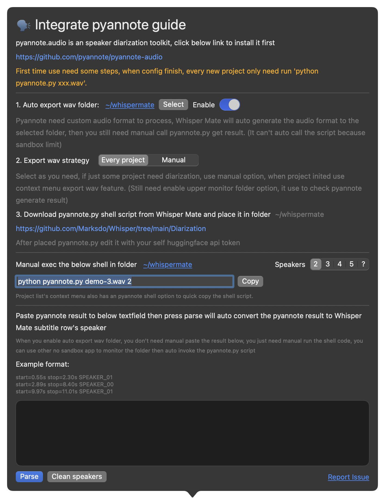

# 🗣️ Integrate Pyannote (Beta)
Whisper Mate 5.5.2 start to support pyannote (https://github.com/pyannote/pyannote-audio)
Cause the macos sandbox app permission issue, You need manual do some steps to use it as diarization in Whisper Mate


# First time use setup
- Set an sync folder to auto export pyannote needed audio.wav file
- Place the pyannote.py to step-1 folder
- edit pyannote.py change use_auth_token to your huggingface api token
- 
```python
pipeline = Pipeline.from_pretrained(
    "pyannote/speaker-diarization-3.1",
    use_auth_token="XXXXXXXXXXXXXXXXXXXXXXXXXXXXXXXXXXXXXXXXXXXX") # please follow the pyannote github to get your huggingface api auth token https://github.com/pyannote/pyannote-audio
```

below steps is copy from pyannote project how to get hf access token
```
Install pyannote.audio with pip install pyannote.audio
Accept pyannote/segmentation-3.0 user conditions
Accept pyannote/speaker-diarization-3.1 user conditions
Create access token at hf.co/settings/tokens.
```





# Every project manual exec
- When project added to Whisper Mate after start process, copy the shell command to exec it in terminal (or use project list context menu copy)
```sh
python pyannote.py project-id.wav
```
- Done (MacOS Sandbox App can't auto execute outside shell script)


> Whisper Mate will auto monitor the sync folder to wait for the pyannote.py result file generate, when pyannote.py execute finish will create project result file
> Whisper Mate then auto load the result file to task, when transcribe complete auto use the pyannote result to put the speaker data to row

You also can manual paste the pyannote result to Whisper Mate then press parse to set speaker data


use replace feature to batch replace  @Speaker_01 to Sam 


# 🎬 Steps Video

