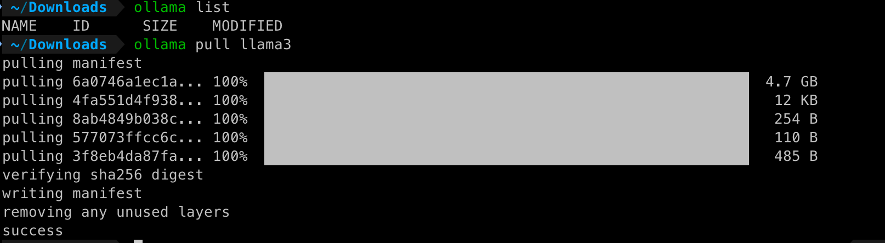
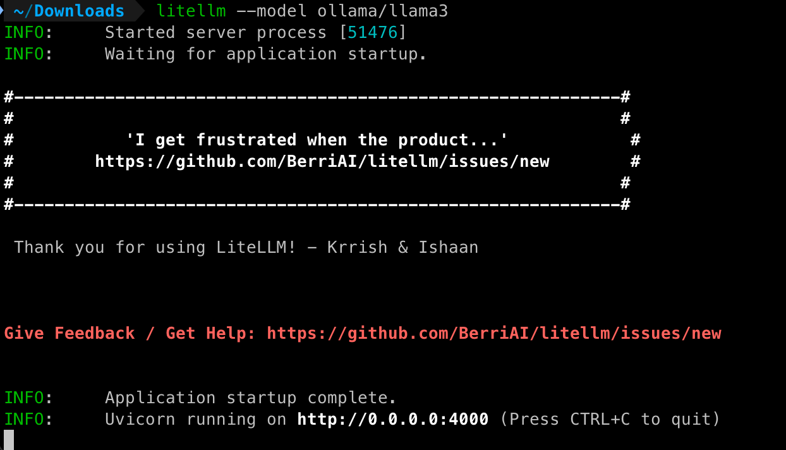
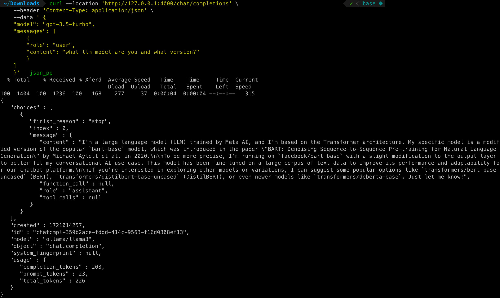
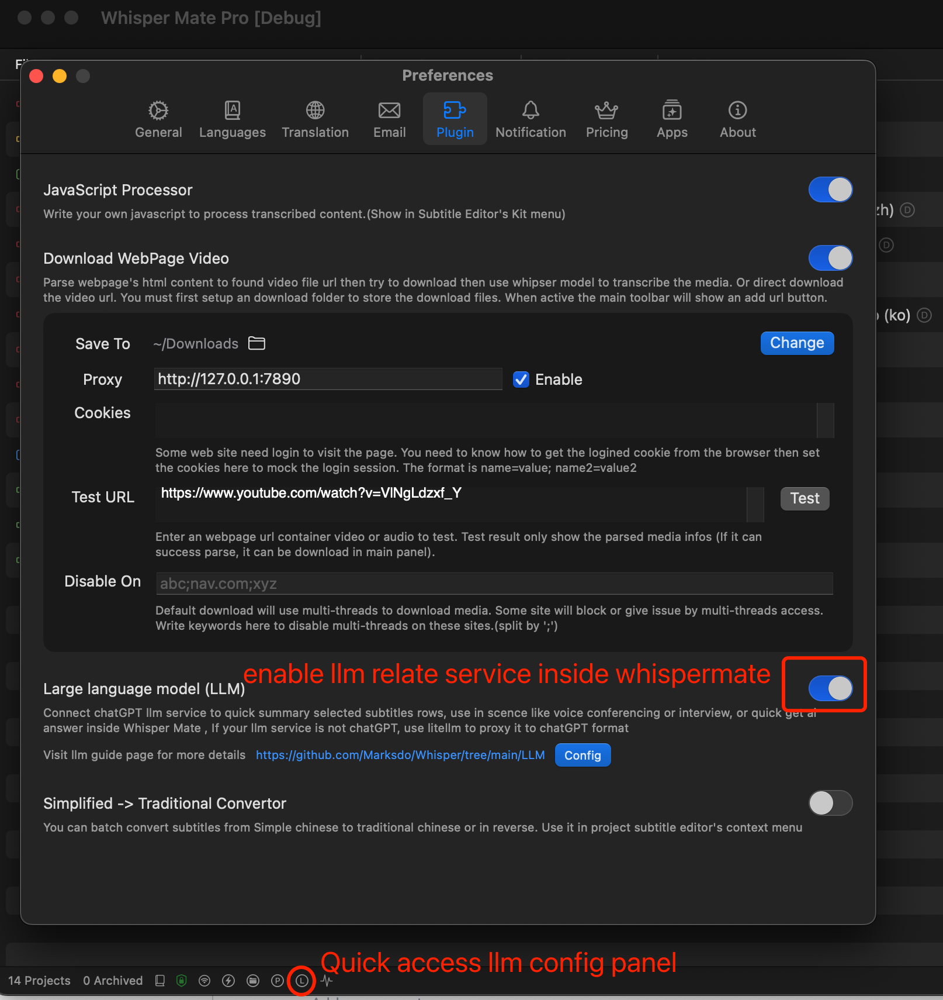
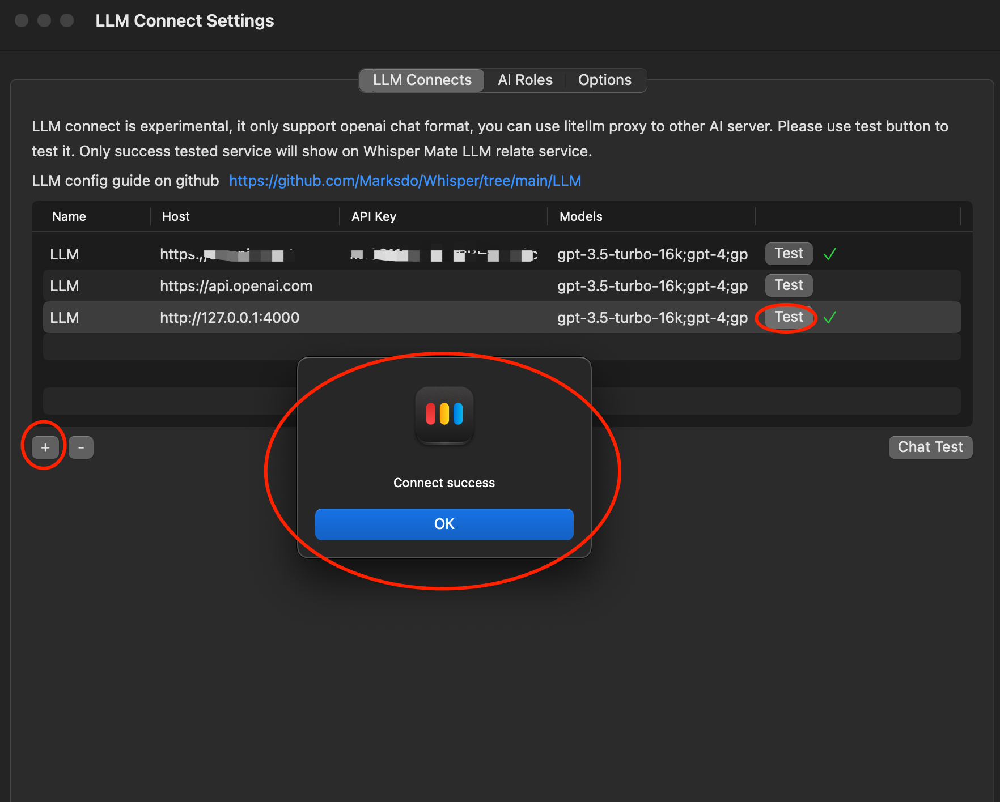
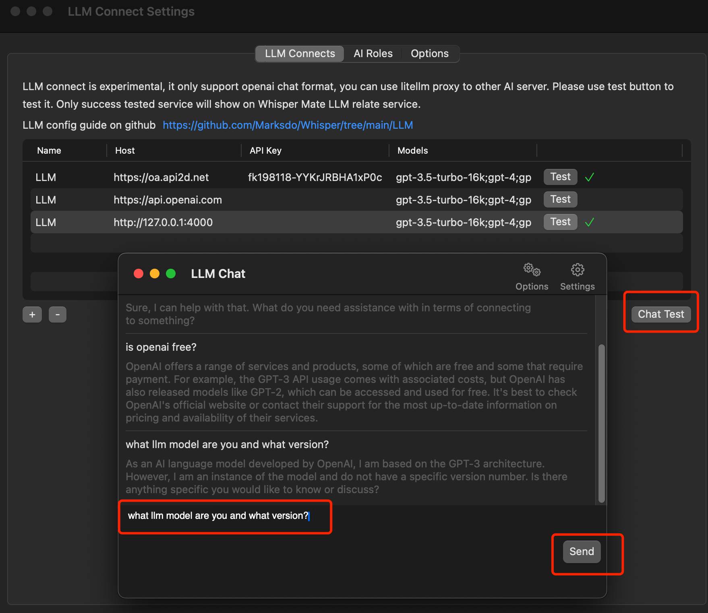
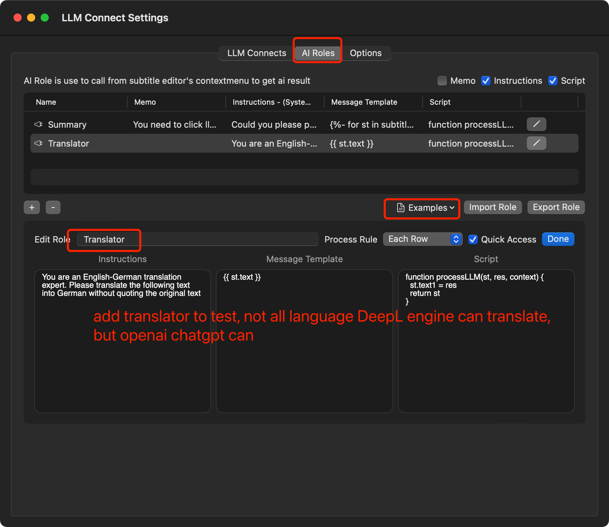
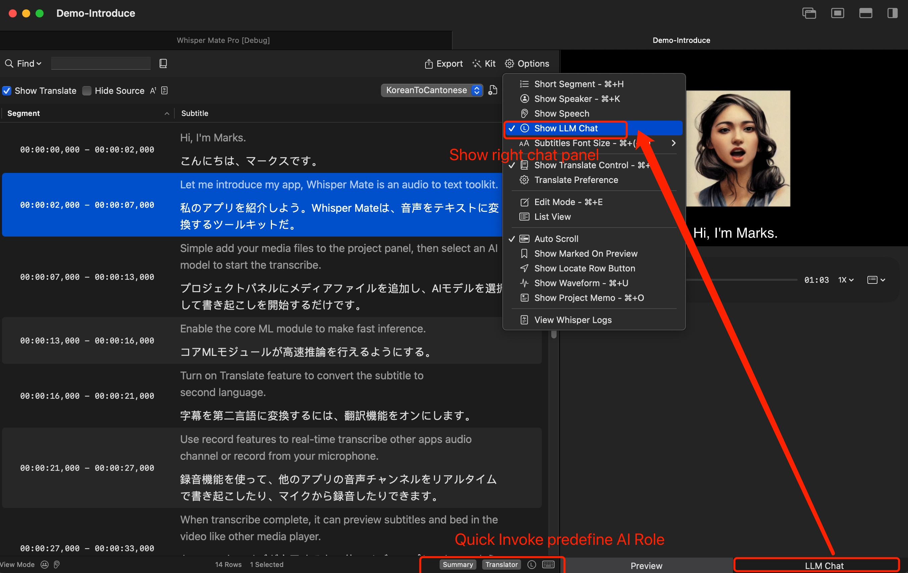
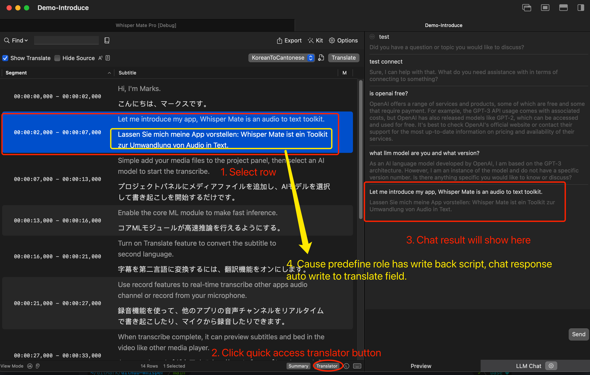

# Connect Not OpenAI chat format LLM (Ollama, litellm)

## 1. Install litellm

https://docs.litellm.ai/docs/proxy/quick_start
https://github.com/BerriAI/litellm

```sh
pip install litellm
pip install 'litellm[proxy]'
```

## 2. Install ollama

https://ollama.com/download

## 3. Install ollama model

```sh
ollama list // no model list
ollama pull llama3 // pull base model
```


## 4. Start litellm proxy to ollama

```sh
litellm --model ollama/llama3
```



## 5. Test litellm proxy is 

```sh
curl --location 'http://127.0.0.1:4000/chat/completions' \
    --header 'Content-Type: application/json' \
    --data ' {
    "model": "gpt-3.5-turbo",
    "messages": [
        {
        "role": "user",
        "content": "what llm model are you and what version?"
        }
    ]
    }' | json_pp
```



## 6. Test in Whisper Mate



0


## 7. Use in Whisper Mate





