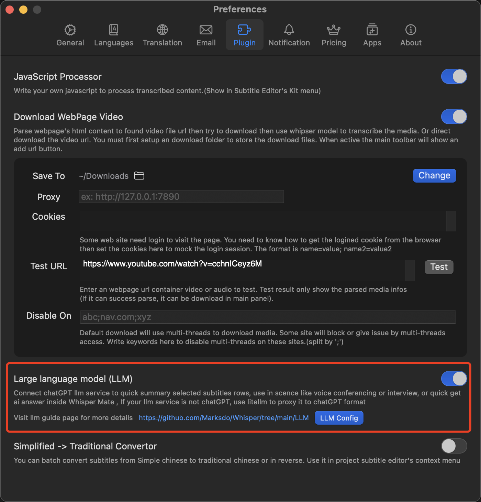
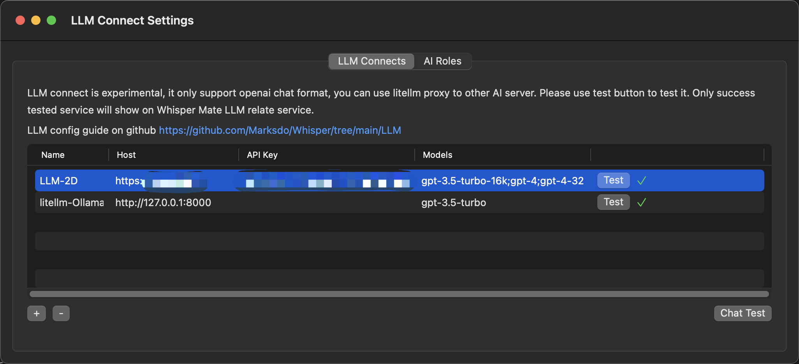
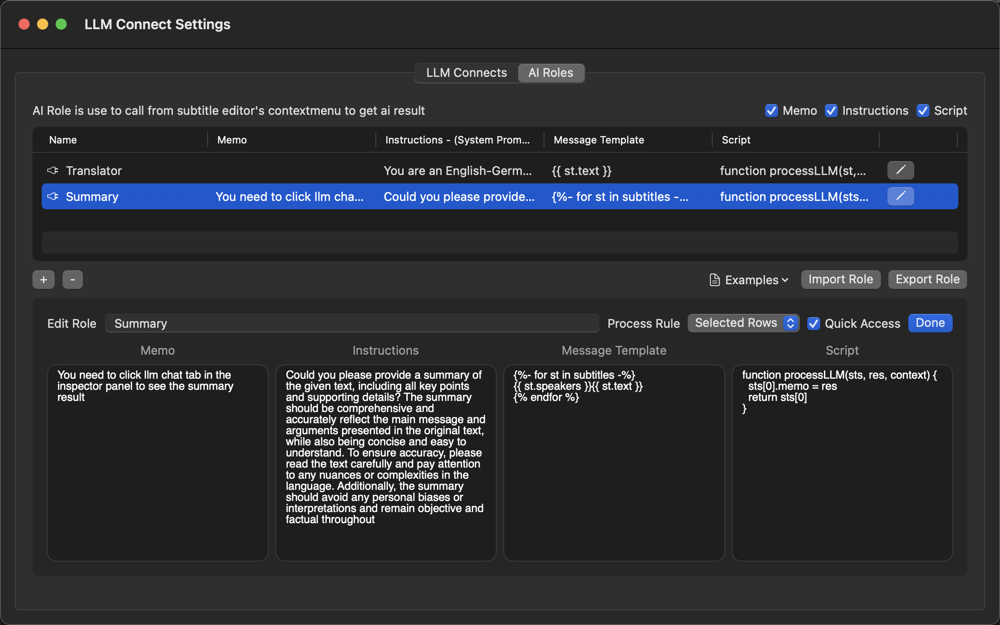
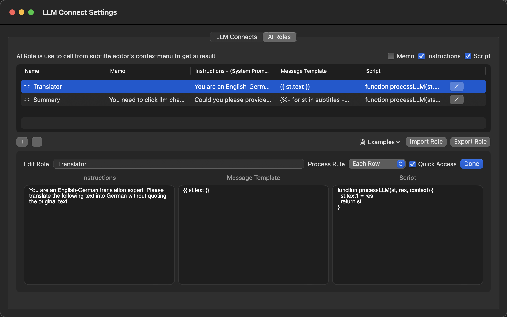
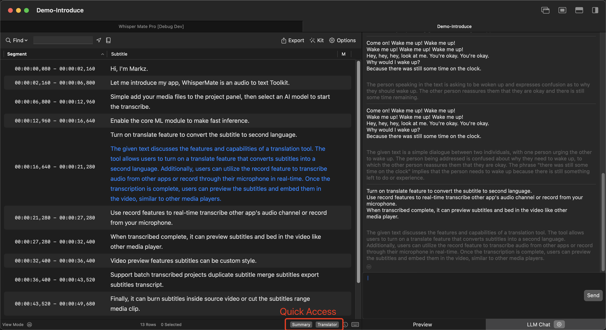
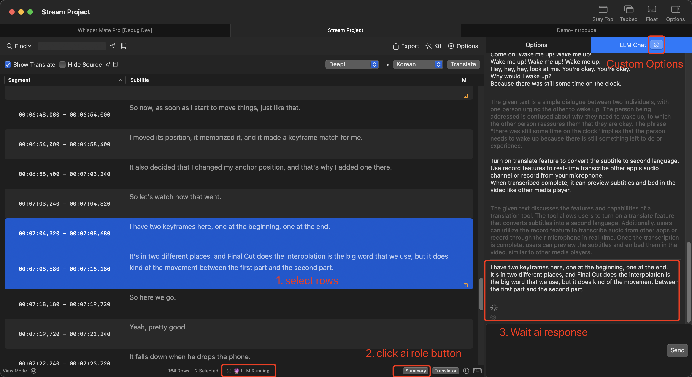

# Connect LLM with Whisper Mate (Experimental) 
- You must have experience and hands-on ability in using LLM
- embed chat with openai gpt inside Whisper Mate
- you can deploy litellm to proxy to other llm service (response with openai chat text format)

# What is can do
- In realtime transcribe of live talk or meetings, let LLM as your assistant, summarize or quick get answer from ai
- In common project let LLM as translator
- ... more

# LLM Plugin
LLM relate feature is an plugin feature, most user no need to active it. It need AI experience and little program skill.

# LLM Connection
llm api format must use openai http format, if the llm is not openai, use [litellm](https://github.com/BerriAI/litellm) to proxy it to openai-chatgpt request format

# AI Role
AI Role is predefined process role, use it to quick convert transcribed text to formated text then send to ai, it also can use script to process ai response text then write back to origin subtitle row

> Whisper Mate current provide 2 prefined examples
> 
> Summary role is use in audio meetings, you can quick select transcribed rows to let ai summary text. 
> 
> Translator role is use ai as translate service, each rows will send to ai to get translated text, then use script to write back response text to translated column

# Instructions
The role instruction can give high level instructions for the conversation.\nYou can also use a system level instruction to guide your model's behavior throughout the conversation. 

# Message Template
Each time you call your prefined role, will use instructions and Message Template to generate chat request.

# Script
LLM response it's text format, you need to custom it response some callback functions keywords to let it changed the origin subtitle, see the example for more details how to change origin data

# Quick Access
Often used ai role you can set it to quick access, then quick invoke it from subtitle editor's bottom statusbar

# Use in realtime stream 
