# 🎶 Whisper Mate: Batch transcribe local de audio/películas a texto con el modelo de IA Whisper. ¡Mantén tu privacidad segura!

Descarga [la última versión desde la App Store de macOS](https://apps.apple.com/us/app/id6450404233)

## Características
Whisper Mate admite la transcripción por lotes de archivos de audio o películas en texto con el modelo de IA Whisper de OpenAI. Con un editor de subtítulos integrado para previsualizar el resultado de la transcripción segmento por segmento. 
Todas las operaciones de transcripción se realizan en la máquina local. Mantén tu privacidad segura.

V5.5.1
---
- Se solucionó el error de cierre en la traducción automatizada al finalizar el proyecto
- [148 MB](https://download.marksdo.com/apps/WhisperMate/V5.5.1/WhisperMate.dmg)

V5.5.0
---
- Se agregó la opción del modelo Deepgram nova-2
- Se agregó el soporte de ventana flotante en tiempo real para transcripción con porcentaje de transparencia personalizado
- Se agregó la opción de transcripción en tiempo real que muestra solo el contenido traducido
- Se agregaron opciones personalizadas para el estilo de la ventana flotante en tiempo real (color de fondo, color de fuente)
- Se solucionó el problema de que las opciones de automatización no se invocaban al usar el motor de transcripción de Deepgram
- Se solucionó el problema de que la ventana flotante de transcripción en tiempo real no se cerraba a veces
- [148 MB](https://download.marksdo.com/apps/WhisperMate/V5.5.0/WhisperMate.dmg)

V5.4.9
---
- Se agregó la función de plantilla de exportación por lotes de proyectos. Permite exportar el resultado de los proyectos seleccionados en un solo archivo a partir de un script de plantilla
- Se corrigieron errores y se mejoró el rendimiento
- [148 MB](https://download.marksdo.com/apps/WhisperMate/V5.4.9/WhisperMate.dmg)

V5.4.8
---
- Se agregaron las configuraciones de privacidad en la barra de estado inferior de la ventana principal, que permiten desactivar la analítica de eventos, los informes de errores y los registros locales
- Se agregó un ejemplo de script para eliminar filas que coincidan con determinadas condiciones
- Se agregó un ejemplo de script para reemplazar una cadena de subtítulos como '(Música) * Música * [Música]' por una cadena vacía
- Se agregaron propiedades de escritura en el archivo .memo .markWarn .warnMsg
- Se agregó la opción de retraso en la visualización de subtítulos del previsualizador
- Se agregó la opción de modificar por lotes el tiempo de inicio o finalización de los subtítulos en el kit de herramientas de edición de subtítulos
- Se agregó el atajo (⇧)+←→ en el editor de subtítulos para saltar rápidamente en la previsualización 5 o 30 segundos
- Se agregó la barra de control de altavoces y se admitió la configuración rápida con atajos
- Se solucionó el problema de que los subtítulos del previsualizador no se ocultaban
- Se solucionó el problema de que el editor de plantillas no podía cortar texto al portapapeles y no se podía seleccionar por arrastrar
- Se solucionó el problema de que los formatos de rango de tiempo .t0f5 .t0f4 .t0f2 del archivo de plantilla personalizada aún devolvían 3 dígitos en milisegundos
- [148 MB](https://download.marksdo.com/apps/WhisperMate/V5.4.8/WhisperMate.dmg)

V5.4.7
---
- Se agregó la opción de inicio automático del proyecto cuando se agrega un archivo a la lista de proyectos (el interruptor está en la barra de estado inferior de la ventana principal)
- Se agregó el paso automatizado para exportar automáticamente los archivos a una carpeta personalizada
- Se agregó el paso automatizado para enviar el resultado por correo electrónico a tu correo electrónico (puede usar automáticamente el resultado de exportación automática anterior como archivo adjunto)
- Se actualizó el editor de plantillas y JavaScript para solucionar problemas de cierre
- [148 MB](https://download.marksdo.com/apps/WhisperMate/V5.4.7/WhisperMate.dmg)

V5.4.6
---
- Se agregó la opción de diseño de subtítulos en la previsualización de medios, los subtítulos de origen y traducidos pueden controlar la visualización en la parte superior o inferior.
- Se agregó el modelo v3 coreml grande
- Se agregó el atajo ⌘+⌥+f o doble toque en la previsualización para cambiar rápidamente a pantalla completa
- Algunos atajos ahora se pueden activar presionando una sola tecla (fusionar, dividir, ajustar)
- Después de fusionar los subtítulos, se selecciona automáticamente la primera fila fusionada
- Se canceló la asociación de la aplicación predeterminada con Whisper Mate para archivos de audio y video
- Se solucionaron algunos errores de cierre en la versión 5.4.5
- Se solucionó el problema de visualización de las notificaciones
- Se solucionaron algunos problemas de traducción
- [123 MB](https://download.marksdo.com/apps/WhisperMate/V5.4.6/WhisperMate.zip)

V5.4.5
---
- ❗Es posible que debas volver a descargar la versión universal. Debido a que actualicé mi dispositivo de desarrollo y olvidé guardar la EDKey de implementación universal.
- Se agregó la función de automatización para ejecutar tareas cuando finalice la transcripción del proyecto (unir repeticiones, captura de pantalla, script, traducción)
- Se agregó la opción de longitud máxima del segmento de transcripción
- Se agregaron ejemplos de mensajes del modelo
- Se agregó la opción de reemplazar con el carácter '\\n' (una sola barra invertida con la letra n) para nueva línea en la función de reemplazo
- Se mejoró la interfaz de configuración de las opciones de transcripción del proyecto
- [122 MB](https://download.marksdo.com/apps/WhisperMate/V5.4.5/WhisperMate.zip)

V5.4.4
---
- Se agregó la lista en la nube de modelos en el panel de configuración del modelo con 2 servidores de descarga (Cambiar a host2 si no se puede descargar en host1)
- Se agregó el soporte de respaldo para utilizar el módulo CoreML cuando se desactiva la opción de aceleración GPU en la configuración general
- Se solucionó el problema de descarga fallida del modelo grande
- Se solucionó el problema de cierre en dispositivos que no son Apple Silicon
- Descarga la edición universal [122 MB](https://download.marksdo.com/apps/WhisperMate/V5.4.4/WhisperMate.zip)

V5.4.3
---
- Se mejoró la velocidad de transcripción
- Se agregó el soporte para el modelo Whisper v3 grande
- Se agregó el soporte para el motor de LibreTranslator
- Se agregó la opción de duplicar un proyecto en el menú contextual del proyecto
- Se actualizó el campo de altavoz para permitir la entrada directa en el modo de edición (⌘+E)
- Se solucionó el problema de la ventana con pestañas cuando el recuento de pestañas es mayor a 2
- Se solucionó el problema de cierre del visor de formas de onda en ocasiones
- Se solucionó el problema de traducción en el editor de subtítulos que no traduce las filas seleccionadas

V5.4.2
---
- Se agregó la opción de configuración de subprocesos de procesamiento de Whisper. (Usar menos subprocesos para permitir que la computadora realice otras tareas, pero el tiempo de procesamiento aumentará)
- Se agregó el soporte para el motor de transcripción de Deepgram, también compatible con el modo de transcripción en tiempo real a través de streaming
- Se agregó un ejemplo de plantilla para exportar solo el contenido del altavoz personalizado
- Se agregó la función de búsqueda de palabras clave que comienzan con @ para filtrar las filas del altavoz o reemplazar todos los nombres de altavoces por otro nombre (por ejemplo, @tom-->jack)
- Se agregó la función de guardar la configuración de los altavoces del proyecto más reciente y reutilizarla en nuevos proyectos.
- La exportación personalizada de plantillas ahora admite hasta 9 plantillas personalizadas.

V5.4.1
---
- Se agregó la función de gestión remota web en intranet, que permite agregar archivos para procesar y ver el estado del procesamiento desde tu teléfono u otro dispositivo (en la barra de estado inferior de la ventana principal)
- Se agregó el selector de plantillas de configuración de los parámetros de IA.
- Se agregó el parámetro "suppress punctuation" en la configuración de IA.
- Se agregó javascript para realizar solicitudes HTTP sincrónicas y obtener o enviar datos (puedes usarlo para enviar los datos de las filas de subtítulos a tu servicio llm local para obtener el resultado de la inferencia y luego rellenar el subtítulo original o enviarlo a otro servicio de sistema HTTP/HTTPS, carga el ejemplo de HTTP desde el procesador JavaScript para ver cómo usarlo)
- Se corrigió el error de desplazamiento de eliminación de ruido wav cuando la ruta del archivo contiene espacios

V5.4
---
- Se agregó la función de corte rápido
- Se agregó el atajo (c) para mostrar u ocultar el reproductor de previsualización del editor de subtítulos
- Se agregó el atajo para cambiar la velocidad de reproducción del reproductor de previsualización del editor de subtítulos
- Se reemplazó la estrategia de silencio por la estrategia de fragmentos
- Se corrigió el error de la opción de reducción de ruido
- Descarga la edición universal [122 MB](https://download.marksdo.com/apps/WhisperMate/V5.4.4/WhisperMate.zip)

### La nueva función de corte rápido cuenta con las siguientes funcionalidades:

- Visualiza la forma de onda de audio para localizar y recortar videos con precisión.
- Divide archivos multimedia largos en múltiples segmentos para su procesamiento separado antes de la transcripción.
- Utiliza la estrategia de fragmentos para omitir segmentos silenciosos o no transcribibles.
- Recorta por separado los segmentos que requieren transcripción en archivos individuales.

V5.3.1
---
- Se agregó la atribución de prioridad del proyecto en la cola de procesamiento por lotes, los proyectos con mayor prioridad se procesarán primero (la opción se encuentra en el menú contextual)
- La función de reemplazo del texto de los subtítulos también reemplaza las palabras clave coincidentes en el texto traducido
- Se corrigieron errores al retranscribir con la estrategia de saltar segmentos silenciosos y reducir el ruido

V5.3
---
- Se agregaron modelos de afinamiento (pequeño/mediano) para diferentes idiomas
- Se agregó la estrategia de salto de segmentos silenciosos en la transcripción (clasificados por decibelios y duración de silencio)
- Se agregó la opción para reducir el ruido de fondo
- Se agregó la opción para mostrar los subtítulos de transcripción antes del tiempo indicado (sin spoilers)
- Se agregó un ejemplo de procesador de JavaScript para capitalizar los subtítulos de segmentos

V5.2
---
- Se agregaron modelos afinados para inferencias en diferentes idiomas: cantonés, chino, coreano, japonés, alemán, francés, tailandés, ucraniano, entre otros.
- Se agregó la funcionalidad de agregar un Modelo de IA Whisper afinado localmente a Whisper Mate.
- Se agregó la funcionalidad de configurar parámetros de modelo para proyectos por lotes.
- Se agregó la opción de evitar que se active el protector de pantalla cuando hay tareas en ejecución.
- Se corrigió el problema de que las tareas en curso se pausaban cuando se activaba el protector de pantalla del sistema.
- Se corrigió el problema de que hacer clic en una fila del editor de subtítulos no siempre llevaba a la posición del reproductor.
- Se corrigió el problema de que la opción de exportación combinaba incorrectamente los rangos de tiempo.

V5.1
---
- Se agregó la funcionalidad de exportar por lotes los segmentos/resultados plantillas de proyectos con la opción de combinar en un solo archivo.
- Se agregó la funcionalidad de retranscribir las filas seleccionadas con diferentes parámetros de IA.
- Se agregó la funcionalidad de deshacer o rehacer cambios de texto en el contenido del subtítulo con cambios de escritura manual (Atajos ⌘+Z deshacer / ⌘+⇧+Z rehacer).
- Se agregó la funcionalidad de agregar una nueva fila de subtítulos vacía debajo de la fila seleccionada (Atajos ⌘+N).
- Se agregó la funcionalidad de enviar notificación de finalización del proyecto a través de un webhook de Slack (recibirás una notificación en el teléfono cuando se complete cada proyecto de transcripción).
- Se corrigió la ubicación de la caja de control de reproducción multimedia cuando se usa un diseño de estilo arriba-abajo.

V5.0
---
- Se agregó una herramienta para fusionar automáticamente los subtítulos en párrafos consecutivos.
- Se agregó la función de procesamiento por lotes de subtítulos mediante un script personalizado.
- Se agregó la función de ajuste del editor de subtítulos. Es similar a la función de división y fusión, y permite seleccionar varias filas y ajustarlas en una sola línea de texto.
- Se mejoró el soporte de atajos en el editor de subtítulos.
- Se agregó la fuente personalizada al estilo de subtitulado de la previsualización del video.
- Se agregó la funcionalidad de grabar un proyecto en el estado actual de los subtítulos. Luego es posible recuperar fácilmente el proyecto a partir de los puntos de guardado.
- Se agregó la función de importar .srt como instantánea en el proyecto actual.
- Se agregó la opción de mostrar el texto traducido sobre el texto de origen en la previsualización de subtítulos en video.
- Se agregaron funciones de exportación personalizadas: números aleatorios, identificadores aleatorios, escXML, reemplazar con formato personalizado.
- Se agregó la opción de tipo de salida en la exportación personalizada (archivo o portapapeles).
- Se agregó la opción de exportar todos los subtítulos o solo los seleccionados.
- Se agregó la opción de agrupar la ventana del editor del proyecto con la ventana principal.
- Se agregaron parámetros de procesamiento addicionales para el modelo Whisper en el selector de modelos (en la esquina inferior derecha), puede que no sean fáciles de encontrar, porque la mayoría de los casos no se necesita modificar estos parámetros.
- Se optimizó el comportamiento del video en pantalla completa.
- El campo de búsqueda ahora permite condiciones con palabras clave que se inician con @ (ejemplo: "hi|hello|hey" para filtrar filas de altavoces o reemplazar todos los nombres de altavoces por otro nombre).
- Se optimizó la lógica de búsqueda y reemplazo. Ahora, al realizar una búsqueda y reemplazar, se mostrarán las palabras clave originales y las palabras clave reemplazadas en los resultados.

V4.0
---
- Se agregó la funcionalidad de recordar la disposición del editor de subtítulos del proyecto. Cada proyecto puede utilizar una disposición y tamaño de reproductor de previsualización diferentes (los proyectos antiguos deben abrirse nuevamente para recordar las disposiciones)
- Se agregó la opción de buscar subtítulos duplicados en el editor
- Se agregó la opción en el menú contextual para abrir el editor incluso si no se ha iniciado el proceso de transcripción del script
- Se agregó la exportación de subtítulos en formato .sbv
- Se agregó la función de plantillas personalizadas de exportación (.fcpxml, .itt, .ttml)
- Se agregó un nuevo complemento
- Se agregaron palabras clave de uso frecuente y una opción de configuración de reemplazo rápido
- Se agregó una marca para las filas marcadas en la vista de progreso del reproductor de previsualización
- Se agregó la opción de marca en el menú contextual del editor de subtítulos
- Se agregó la función de dividir filas en el editor de subtítulos al seleccionar una sola fila
- Se agregó el nombre del proyecto en el resultado de búsqueda
- Se agregó la opción para ocultar el botón de ubicación de fila del editor
- Se agregó el atajo ⌘+S para exportar rápidamente a un archivo .srt
- Se corrigió el problema de que los metadatos del canal de audio obtenían dos canales de audio, pero en realidad solo había uno (se agrega la opción para ignorar la selección del canal de audio)
- Se corrigió el problema de que fallaba la quema de subtítulos cuando el nombre del proyecto se había cambiado manualmente
- Se corrigieron algunos problemas de la interfaz de usuario en macOS 12
- Se corrigieron algunos problemas de visualización de la interfaz de usuario en el tema claro

## Funcionalidades

- Transcribe archivos de audio o video
- Admite la captura y transcripción de audio en otras aplicaciones como Zoom/Skype/Teams/Otras aplicaciones (solo en macOS 13.0+ y requiere permiso de grabación de pantalla)
- Utiliza la API gratuita de DeepL para traducir subtítulos
- Editor de subtítulos integrado para corregir la transcripción
- Exporta a formatos SRT, VTT, CSV, JSON, SEGMENT
- Permite asignar un altavoz a cada subtítulo
- La mayoría de las operaciones admiten la selección por lotes. Por ejemplo, ejecutar tareas por lotes, traducir filas por lotes, establecer altavoces por lotes
- Permite arrastrar y soltar archivos para iniciar la transcripción
- Permite escribir en la búsqueda de transcripción
- El editor puede reproducir audio o video en sincronización con el rango de reproducción
- Exporta el rango de medios de los subtítulos seleccionados a un nuevo archivo de clip de medios
- Exporta el video con subtítulos quemados al video original y permite personalizar el estilo de subtítulos
- Permite previsualizar los subtítulos dentro del video (el estilo de subtítulos se puede personalizar en el panel de preferencias)
- Graba audio del micrófono y admite transcripción en tiempo real (solo en macOS 13+)
- Fusión de subtítulos. Combina el rango de segmentos y subtítulos en una sola fila.
- La grabación del audio de una aplicación se guarda automáticamente en un archivo y se puede convertir en un nuevo proyecto de transcripción.
- Duplica una fila de subtítulo y permite modificar su contenido o rango de tiempo para ajustar los subtítulos completos.
- Permite previsualizar el video y personalizar la velocidad de reproducción
- Muestra el porcentaje de uso de la CPU durante el procesamiento de Whisper
- Admite proyectos archivados con menú contextual (mantiene la lista de proyectos de trabajo limpios)
- Admite Google Translate en el control de traducción de subtítulos
- Permite la previsualización a tamaño completo del video con la disposición de subtítulos
- Permite abrir archivos multimedia desde el buscador con la función "Abrir con"
- Admite la conversión de múltiples idiomas
- Admite la conversión o traducción frecuente con idiomas personalizados

## Capturas de pantalla

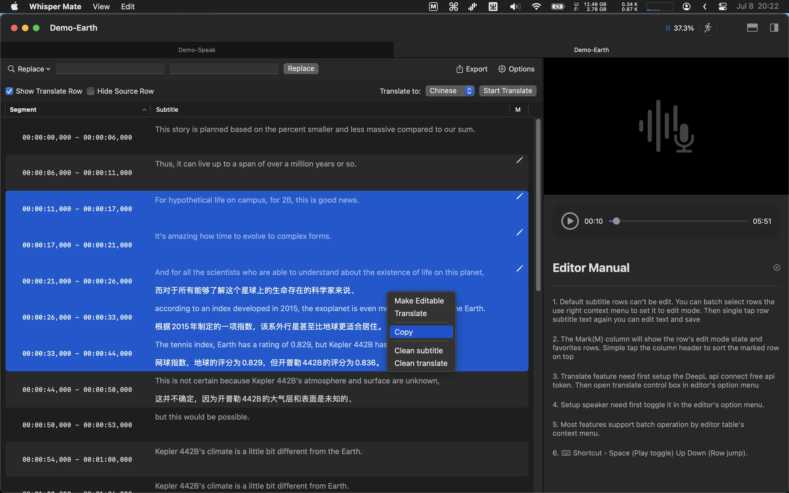

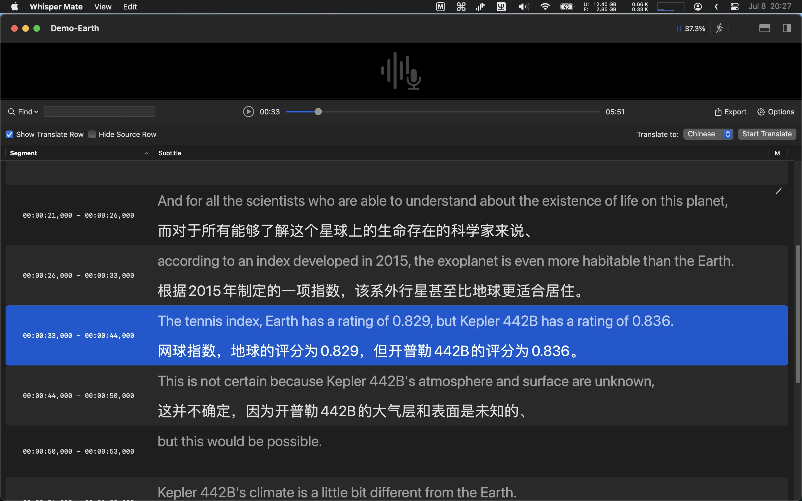

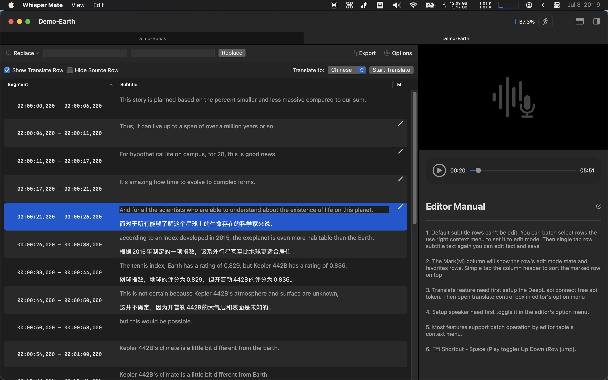

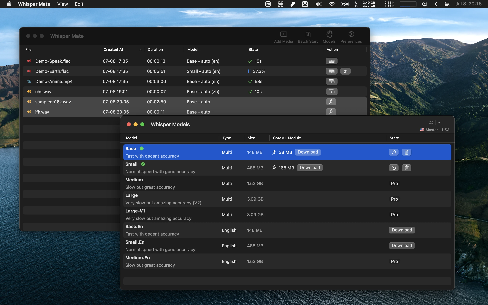

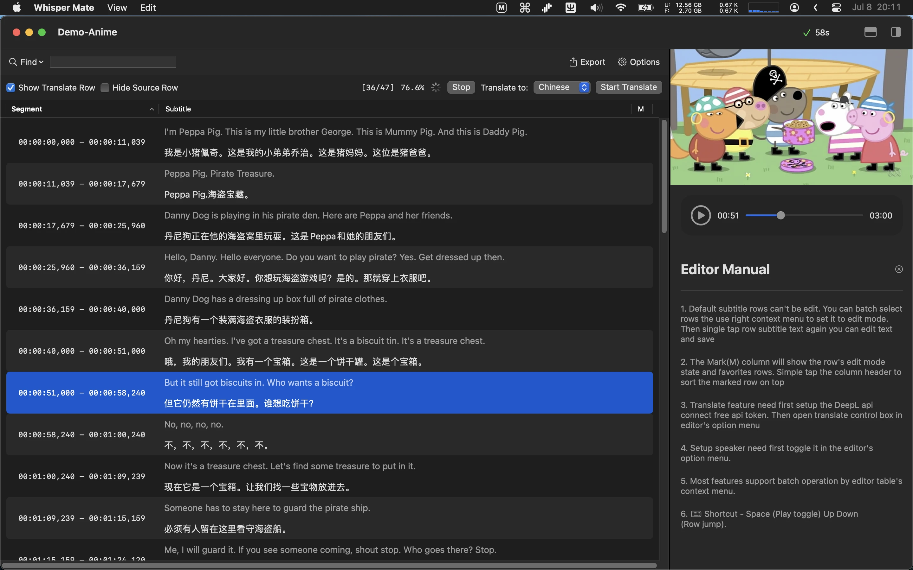

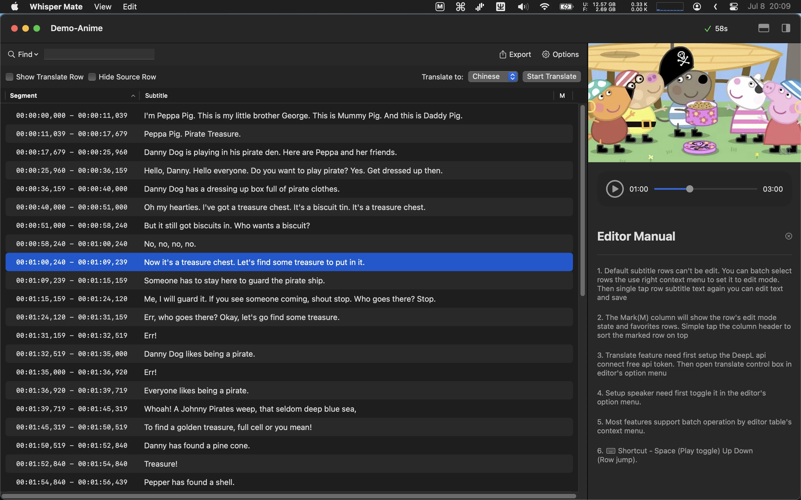

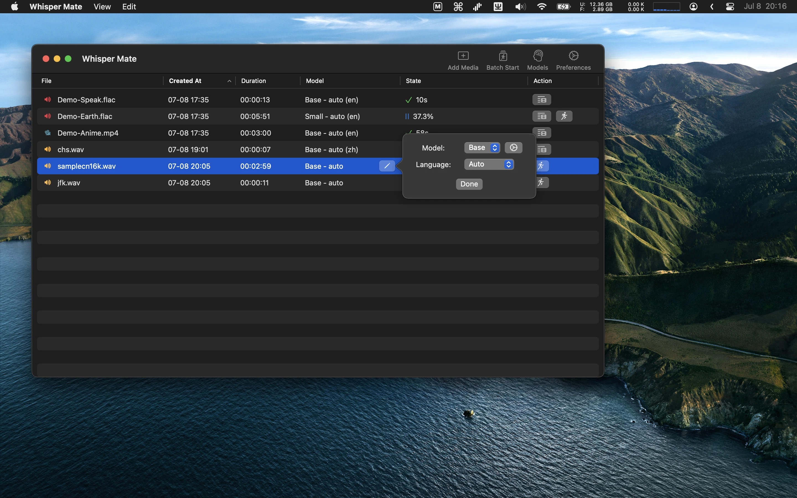

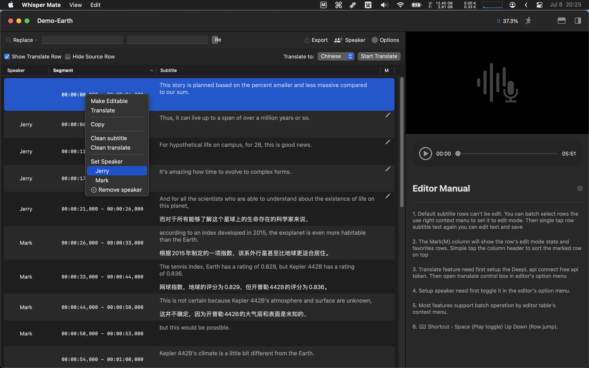

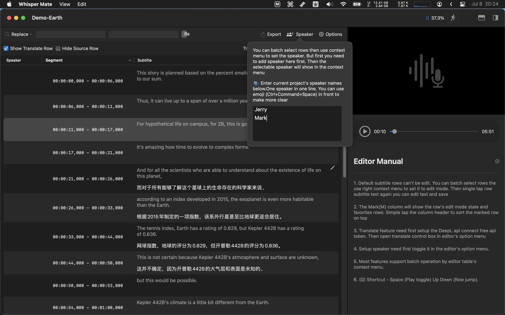

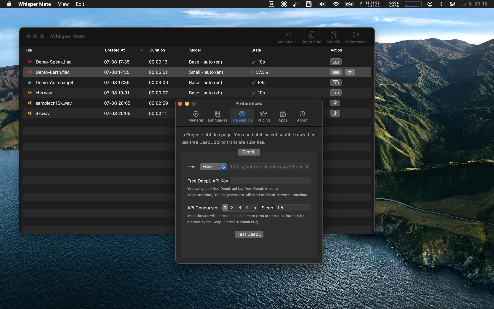

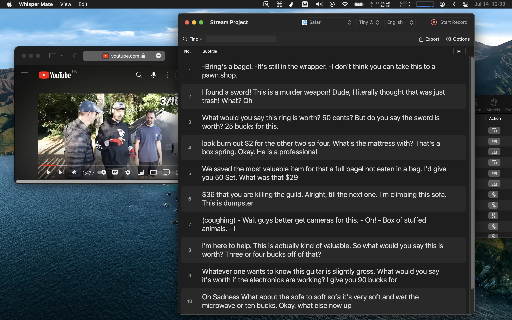

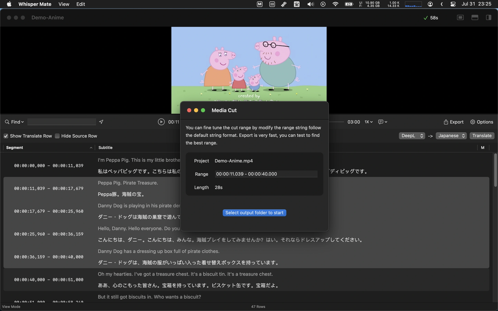

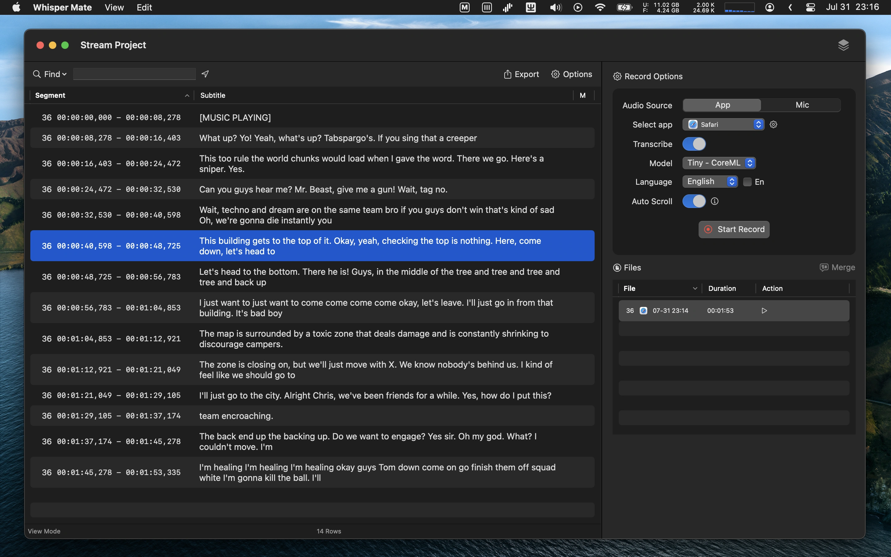

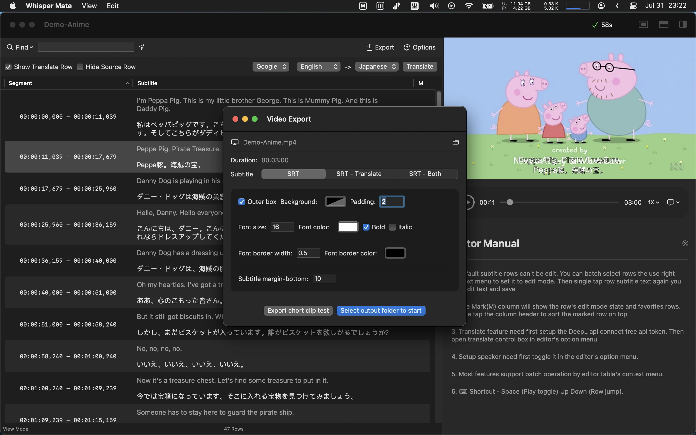

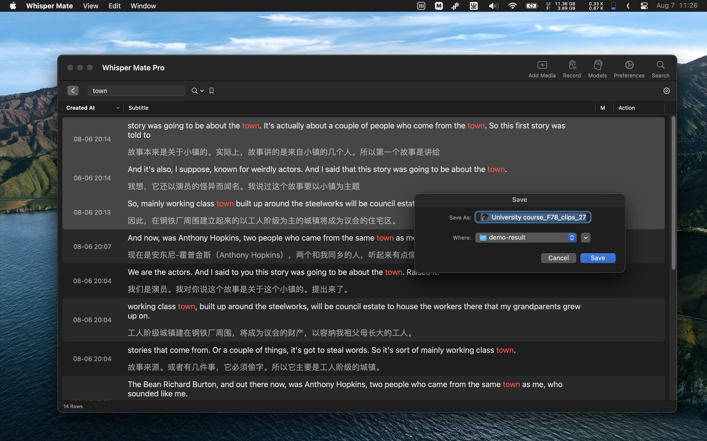

