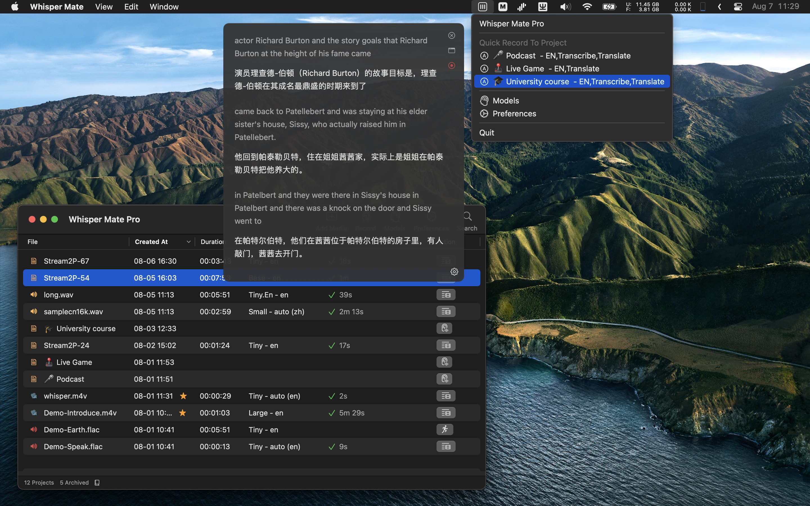

# README.md
- [Deutsch](README.de.md)
- [English](README.md)
- [Spanish](README.es.md)
- [Finnish](README.fi.md)
- [French](README.fr.md)
- [Italian](README.it.md)
- [Indonesian](README.id.md)
- [언어](README.ko.md)
- [日本語](README.ja.md)
- [简体中文](README.zh_cn.md)
- [繁体中文](README.zh_tw.md)
- [Norwegian](README.nb.md)
- [Dutch](README.nl.md)
- [Polish](README.pl.md)
- [Portuguese](README.pt_PT.md)
- [Swedish](README.sv.md)
- [ภาษาไทย](README.th.md)
- [Turkish](README.tr.md)
- [Ukrainian](README.uk.md)
- [Vietnamese](README.vi.md)

# 🎶 Whisper Mate - 音声/ビデオのテキスト変換をホイスパー-IAモデルを使用してローカルで実行。 プライバシーを保つ！

[最新バージョンをMac App Storeでダウンロード](https://apps.apple.com/fr/app/id6450404233)。

## 特徴
Whisper Mateは、OpenAIのWhisper-IAモデルを使用して、オーディオファイルやビデオファイルをテキストに大量変換することができます。内蔵の字幕エディターを使用して、変換結果をセクションごとに表示することができます。
すべての変換プロセスは、デバイス内でローカルに実行され、プライバシーが守られます。

V5.5.1
---
- プロジェクトが完了した後、自動翻訳のエラーを修正してください。
- [148 MB](https://download.marksdo.com/apps/WhisperMate/V5.5.1/WhisperMate.dmg) 

V5.5.0
---
- Deepgram nova-2モデルのオプションを追加しました
- 透過度のカスタマイズ可能なポップアップウィンドウでのリアルタイムトランスクリプトのサポートを追加しました
- リアルタイムトランスクリプトで翻訳結果のみ表示するオプションを追加しました
- リアルタイムポップアップウィンドウのスタイル（背景色、文字色）をカスタマイズできるオプションを追加しました
- Deepgramのトランスクリプションモデルを使用している場合に自動化設定が呼び出されない問題を修正しました
- リアルタイムトランスクリプトウィンドウが時折開きっぱなしになる問題を修正しました
- [148 MB](https://download.marksdo.com/apps/WhisperMate/V5.5.0/WhisperMate.dmg) 

V5.4.9
---
- バッチエクスポートプロジェクトテンプレート機能の追加。これにより、テンプレートスクリプトから選択したプロジェクトの結果を1つのファイルにエクスポートすることができます。
- バグ修正とパフォーマンスの改善
- [148 MB](https://download.marksdo.com/apps/WhisperMate/V5.4.9/WhisperMate.dmg) 

V5.4.8
---
- メインウィンドウの下部ステータスバーにプライバシー設定を追加し、イベントの解析、クラッシュレポート、ローカルログを無効にすることができるようにする
- 条件に一致する行を削除するスクリプトの例を追加
- '(Music) * Music * [Music]' のような字幕文字列を空文字列に置換するスクリプトの例を追加
- プロパティ .memo .markWarn .warnMsg を書き戻すスクリプトを追加
- プレビューサブタイトルの遅延表示オプションを追加
- サブタイトルエディタツールキットで、一括でサブタイトルの開始または終了時間を修正する機能を追加
- サブタイトルエディタで (⇧)+←→ ショートカットを追加して、プレビューサブタイトルのジャンプを5秒または30秒に素早く移動する機能を追加
- スピーカーコントロールバーを追加し、ショートカットでのクイック設定をサポート
- プレビューサブタイトルが非表示にならない問題を修正
- テンプレートエディタでテキストをクリップボードに切り取ったり、ドラッグで選択できない問題を修正
- カスタムテンプレート .t0f5 .t0f4 .t0f2 のエクスポート時の時間範囲形式がミリ秒で3桁の数字を返す問題を修正
- [148 MB](https://download.marksdo.com/apps/WhisperMate/V5.4.8/WhisperMate.dmg) 

V5.4.7
---
- プロジェクトリストにファイルが追加されたときに、プロジェクトの自動開始オプションを追加する（トグルはメインウィンドウの下部ステータスバーにあります）
- 自動的にファイルをカスタムフォルダにエクスポートする自動化ステップを追加する
- 結果をメールボックスに送信する自動化ステップを追加する（前の自動エクスポート結果を添付ファイルとして自動使用できます）
- テンプレートとJavaScriptエディタをアップグレードしてクラッシュの問題を修正する
- [148 MB](https://download.marksdo.com/apps/WhisperMate/V5.4.7/WhisperMate.dmg) 

V5.4.6
---
- メディアプレビュー字幕のレイアウトオプションを追加しました。ソースのトランスクリプトと翻訳された字幕は表示を上下に制御できます。
- 大型のv3コアMLモデルを追加しました。
- ショートカット⌘+⌥+fまたはプレビューをダブルタップしてフルスクリーンに素早く切り替える機能を追加しました。
- 一部のショートカットは単一の文字を押すことで実行されるようになりました（結合、分割、調整）。
- 字幕を結合した後、自動で最初の結合行が選択されるようになりました。
- オーディオおよびビデオファイルにWhisper Mateとのデフォルトのアプリのバインドをキャンセルしました。
- V5.4.5で発生していたクラッシュバグを修正しました。
- 通知の表示に問題がある部分を修正しました。
- いくつかの翻訳の問題を修正しました。
- [123 MB](https://download.marksdo.com/apps/WhisperMate/V5.4.6/WhisperMate.zip) 

V5.4.5
---
- ❗ユニバーサルバージョンは再度ダウンロードする必要があるかもしれません。開発デバイスをアップグレードしたため、ユニバーサル展開EDKeyを保存し忘れました。
- プロジェクトの転写が完了した時にジョブを実行する自動化機能を追加しました（繰り返しのマージ/スナップショット/スクリプト/翻訳）。
- 最大セグメント長の転写オプションを追加しました。
- モデルのプロンプト例を追加しました。
- 置換機能で文字 '\\n'（スラッシュと文字nの組み合わせ）で改行を置換するようにしました。
- プロジェクトの転写オプションの設定インターフェースをアップグレードしました。
- [122 MB](https://download.marksdo.com/apps/WhisperMate/V5.4.5/WhisperMate.zip)

V5.4.4
---
- モデル設定パネルにモデルクラウドリストを追加しました。2つのダウンロードホストをサポートしています。（ホスト1でダウンロードできない場合は、ホスト2に切り替えてください）
- 一般設定でGPUアクセラレーションオプションを無効にした場合、CoreMLモジュールの使用をサポートするフォールバックを追加しました。
- 大きなモデルのダウンロードが失敗する問題を修正しました。
- Apple Siliconデバイス以外でのクラッシュ問題を修正しました。
- [122 MB](https://download.marksdo.com/apps/WhisperMate/V5.4.4/WhisperMate.zip) 

V5.4.3
---
- 音声書き起こしの速度を改善しました。
- Whisper Large-V3モデルのサポートを追加しました。
- LibreTranslatorエンジンのサポートを追加しました。
- プロジェクトのコンテキストメニューにプロジェクトの複製を追加しました。
- 編集モード（⌘+E）でスピーカーフィールドに直接入力できるように更新しました。
- タブが2つ以上ある場合のタブウィンドウの問題を修正しました。
- ウェーブフォームビューが時々クラッシュする問題を修正しました。
- 字幕エディタで選択された行を翻訳できない問題を修正しました。

V5.4.2
---
- Whisperの処理スレッド数の設定オプションを追加します。 （少ないスレッドを使用すると、コンピュータが他のジョブを実行できますが、処理時間が増えます）  
- Deepgramの転写エンジンのサポートを追加し、リアルタイムストリーム転写モードでもサポートします。  
- カスタムスピーカーのコンテンツのみをエクスポートするためのテンプレート例を追加します。  
- @で始まる検索キーワードを追加して、スピーカーの行をフィルタリングしたり、すべてのスピーカー名を別の名前に置換したりします（例：@tom-->jack）。  
- 最新のプロジェクトのスピーカー設定を保存して、新しいプロジェクトで再利用する機能を追加します。  
- カスタムテンプレートエクスポートは、現在9つのカスタムテンプレートをサポートします。

V5.4.1
---
- イントラネットウェブリモート管理機能を追加しました。電話や他のデバイスを使用して処理するファイルを追加し、処理状態を表示できます（メインウィンドウの下部ステータスバーに表示されます）。
- AIパラメータの設定テンプレートセレクターを追加しました。
- 句読点を抑制するAIパラメータを追加しました。
- JavaScriptを追加して、同期的なHTTPリクエストを使用してデータを取得または送信します（これを使用して、字幕の行データをローカルLLMサービスに送信して修正結果を取得し、元の字幕に戻すことができます。または、他のHTTP / HTTPSシステムサービスに送信することもできます。JavaScriptプロセッサからHTTPの例をロードして使用方法を確認してください）。
- ファイルパスにスペース文字が含まれている場合のデノイズWAVエラーを修正しました。

V5.4
---
- クイックカット機能を追加しました。
- ショートカット（c）を追加して、字幕エディタのプレビュープレーヤーを表示または非表示にします。
- ショートカットキーを追加して、字幕エディタのプレビュープレーヤーの再生速度を変更できます。
- サイレントストラテジーをチャンクストラテジーに置き換えました。
- デノイズオプションのバグを修正しました。

### 新しいクイックカット機能には、以下の機能があります：
- 音声波形を視覚化してビデオの正確な位置を特定し、トリミングします。
- 長いマルチメディアファイルを別々に処理するために複数のセグメントに分割し、トランスクリプト前に無音または非トランスクライブ可能なセグメントをスキップするためのチャンクストラテジーを使用します。
- トランスクリプトが必要なセグメントを個別のファイルとしてトリミングします。

V5.3.1
---
- バッチ処理キューにプロジェクトの優先度属性を追加しました。より高い優先度が最初に処理されます（オプションはコンテキストメニューにあります）。
- サブタイトルのテキスト置き換え機能では、翻訳されたテキスト内の一致するキーワードも置き換えられます。
- サイレントスキップストラテジーとノイズ低減機能を使用した再転写の問題を修正しました。

V5.3
---
- チューニング済みモデル（小規模/中規模）を言語ごとに追加しました。
- サイレントセグメントをスキップするための転写ストラテジーを追加しました（デシベルと無音の長さで分類）。
- バックグラウンドノイズを減らすオプションを追加しました。
- 転写中にタイムスタンプの前に表示されるサブタイトルを抑制するオプションを追加しました（ネタばれを回避）。
- セグメントのサブタイトルを大文字にするためのJavaScriptプロセッサの例を追加しました。

V5.2
---
- 様々な言語の推論用にFine-tunedモデルを追加。広東語/中国語/韓国語/日本語/ドイツ語/フランス語/タイ語/ウクライナ語...
- ローカルでチューニングしたWhisper AIモデルをWhisper Mateに追加する機能を追加しました。
- プロジェクトのモデルパラメータを一括で設定する機能を追加しました。
- 実行中のキューがある場合にスクリーンセーバーを開始しないようにするオプションを追加しました。
- システムのスクリーンセーバーが開始されたときにタスクが一時停止する問題を修正しました。
- 字幕エディタの行をクリックしても再生位置に移動しない場合がある問題を修正しました。
- 字幕エディタでテキストを変更した場合に、コンテキストメニューから元に戻すとやり直しできない問題を修正しました。
- 結合したタイムレンジが一致しない場合の一括エクスポートの問題を修正しました。

V5.1
---
- 一括エクスポート機能を追加し、オプションで1つのファイルに結合することができるようにします。  
- 選択行を異なるAIパラメータで再転記する機能を追加します。  
- 手動タイピング変更による字幕テキストコンテンツのテキスト変更を元に戻す/やり直す機能を追加します（ショートカット⌘+Z 元に戻す/⌘+⇧+Z やり直す）。  
- 選択行の下に新しい空の字幕行を追加する機能を追加します（ショートカット⌘+N）。  
- Slackの着信ウェブフックを利用してプロジェクトが完了したことを通知する機能を追加します（各プロジェクトの転記が完了した際に電話に通知ができます）。  
- メディア再生コントロールボックスの場所が、上下スタイルのレイアウトになっているときに中央に揃わない問題を修正します。

V5.0
---
- 連続した段落の字幕を素早く自動マージするキットを追加する  
- 大量の転写された字幕を一括で調整するカスタムスクリプトプロセッサを追加する  
- 字幕エディタの調整機能を追加する。分割やマージ機能と似ています。複数行を選択して、1つのテキストフィールドで一行ずつ調整できます  
- より多くのショートカットサポートを備えた字幕エディタを追加する  
- ビデオプレビューの字幕スタイル設定パネルにカスタムフォントを追加する  
- ハード字幕を元のビデオに書き込む際にカスタムフォントを追加する  
- pdfまたはdocxのエクスポートサポートを追加する。エクスポートサフィックスにpdfまたはdocxを設定すれば、簡単に実行できます  
- もっと多くの事前定義されたエクスポート例のフォーマットを追加する。例から読み込んで、テンプレートの結果を簡単に調整できます  
- 現在のプロジェクトの字幕状態のスナップショットを作成する機能を追加する。保存されたスナップショットに簡単に戻ることができます  
- .srtを現在のプロジェクトにスナップショットとしてインポートする機能を追加する  
- プレビュービデオの字幕に翻訳されたテキストを表示するオプションを追加する  
- カスタムエクスポート機能を追加する。ランダムな数字、ランダムなGUID、EscXML、カスタムフォーマットでのreplaceString  
- カスタムエクスポート出力タイプ（ファイルまたはクリップボード）を追加する  
- エクスポートにすべての字幕を使用するか、選択した字幕のみを使用するかを指定するカスタムエクスポートオプションを追加する  
- メインウィンドウオプションを含むプロジェクトエディタウィンドウグループを追加する  
- モデルセレクター（右下隅にある）で追加のホワイトモデルプロセスパラメーターの設定を行う。大抵の場合、これらのパラメーターを変更する必要はありません  
- フルスクリーンプレビュービデオの動作を最適化する  
- キーワードの検索サポートまたは条件（orキーワードとして|を使用する。 例：「hi | hello | hey」）  
- 検索と置換ロジックを最適化する。置換exeを実行すると、検索キーワードはsrcキーワードと置換されたキーワードを表示するように調整されます  
- リアルタイムストリーム転写ロジックを最適化する  
- サブウィンドウが前面に表示されない問題を修正する  
- Export xmlフォーマットのいくつかのバグを修正する  
- いくつかのメディア抽出wavが失敗する問題を修正する  
- 置換キーワードフィールドから離れると自動的に置換アクションが発生する問題を修正する  
- ストリームプロジェクトでのいくつかのクラッシュ問題を修正する

V4.0
---
- プロジェクトの字幕エディタのレイアウトプロパティを記憶する機能を追加します。各プロジェクトごとに異なるレイアウトとプレビュープレーヤーのサイズを使用できます。（古いプロジェクトは再度開く必要があり、レイアウトプロパティが記憶されます）
- エディタで重複する字幕を検索するオプションを追加します。
- エディタを開くためのコンテキストメニューオプションを追加します（逐次変換スクリプトの処理が開始されていなくても）。
- 字幕を.sbv形式でエクスポートするオプションを追加します。
- カスタムエクスポートテンプレート機能を追加します（.fcpxml、.itt、.ttmlなど）。
- 新しいプラグインを追加します。
- よく使用するキーワードと置換の構成オプションを追加して、検索や置換の再利用を素早く行えるようにします。
- プレビュープレーヤーの進行表示にマークフラグを表示するオプションを追加します。
- 字幕エディタのコンテキストメニューにマークオプションを追加します。
- 個別の行を選択した際に字幕エディタで行を分割する機能を追加します。
- 検索結果にプロジェクト名を行ごとに表示するオプションを追加します。
- プリプログレスメディアがエラーに遭遇した場合にエラー情報を表示するオプションを追加します。
- エディタの行を特定するボタンを非表示にするオプションを追加します。
- .srtファイルにクイックエクスポートするための⌘+Sショートカットを追加します。
- メディアチャンネルのオーディオメタ情報が2つのオーディオチャンネルを取得するが、実際は1つの場合に修正します（オーディオチャンネルの選択を無視するオプションを追加）。
- プロジェクト名が手動で変更された場合に字幕の書き込みが失敗する問題を修正します。
- macOS12でのいくつかのUIの問題を修正します。
- ステイオン機能がロックされない場合にステータスバーアイコンオプションを非表示にする問題を修正します。
- ライトテーマのUIの表示に関するいくつかの問題を修正します。

V3.5
---
- 字幕音声クリップのダウンロード機能を追加しました。任意の字幕を選択してコンテキストメニューを使用して音声クリップをダウンロードできます。複数の行が選択された場合、自動的に1つの音声クリップに統合されます。
- リアルタイム録音のための小さなフローティングウィンドウスタイルを追加しました。
- メニューバーコンテキストメニューによるプロジェクトへのストリーム録音のクイックスタートを追加しました。新しいフローティングウィンドウで開始できます。
- グローバル検索結果でセグメント行範囲のオーディオをクイック再生するか、検索結果のオーディオ範囲クリップを直接ダウンロードするためのオプションを追加しました。
- モデルのダウンロードが中断再開をサポートするようになりました。
- エディタで任意の字幕にメモを追加する字幕メモ機能を追加しました。
- Azure翻訳オプションを追加しました。
- すべてのプロジェクトでのグローバルな字幕検索を追加しました。
- 検索結果で検索キーワードをハイライト表示する機能を追加しました。
- クローズ/ズーム/最小化などのクイックコントロールウィンドウのデフォルトのショートカットを追加しました。
- メインツールバーのラベルを非表示にするオプションを追加しました。
- バッチ開始ボタンをメインツールバーからコンテキストメニューに移動しました。
- 置換が空の文字列で置換できない問題を修正しました。
- バックアップサーバーの小さなモデルと小さな英語モデルが欠落していた問題を修正しました。
- 録音されたオーディオファイルプレーヤーのスライダーの位置の字幕の問題を修正しました。

V3.0
---
- 新しいメディアクリップファイルに選択された字幕のメディア範囲をエクスポートする機能を追加します。
- ハードサブタイトルをオリジナルビデオに焼き込んでビデオをエクスポートする機能を追加します。また、カスタムサブタイトルスタイルも追加します。
- ビデオプレビュー内で直接サブタイトルをプレビューする機能を追加します（サブタイトルスタイルは環境設定パネルでカスタマイズ可能です）。
- マイクの音声を録音し、リアルタイムで転写する機能を追加します（macOS13以上対応）。
- サブタイトルのマージ機能を追加します。セグメント範囲とサブタイトルが1つの行にマージされます。
- アプリの音声を録音してファイルに自動保存し、新しい転写プロジェクトに変換する機能を追加します。
- サブタイトル行を複製し、その内容や時間範囲を修正してフルサブタイトルを微調整するオプションを追加します。
- プロジェクトモデル設定パネルで英語に翻訳するためのウィスパー埋め込み翻訳を有効にするオプションを追加します。
- プロジェクトモデル設定パネルでウィスパープロンプトトークン設定を使用するオプションを追加します。
- ビデオのプレビュー時にサブタイトル行の自動スクロールを無効にするオプションを追加します。
- メディアプレビューのリプレイスピードをカスタマイズするサポートを追加します。
- コピーされたファイルを処理キューに貼り付けるための⌘+Vのサポートを追加します。
- 編集モードにクイック切替え機能を追加します。すべてのサブタイトルをショートカット（⌘+E）で編集または表示に切り替えることができます。
- ウィスパー処理中にCPU使用率パーセント表示を追加します。
- コンテキストメニューでプロジェクトをアーカイブするサポートを追加します（作業中のプロジェクトリストをきれいに保つため）。
- サブタイトル翻訳コントロールにGoogle翻訳を追加します。
- より多くのアプリの言語のサポートを追加します。
- サブタイトルレイアウトでフルサイズプレビューメディアをサポートします。
- ファインダーの「開く」機能を使ってメディアファイルを開くためのサポートを追加します。
- 大容量のデータ行でのサブタイトルエディタの描画速度を最適化します。
- 複数のオーディオチャンネルビデオの選択問題を修正します。
- プレビューとエディタのサブタイトルがジャンプし、ビデオスライダーのナビゲーションに問題がある場合に修正します。

V2.0 
---
- Zoom/Skype/Teams/ミーティングアプリなどの他のアプリでオーディオをキャプチャして転記する機能をサポート（macOS13.0以上のみ）
- 字幕を簡体字から繁体字にバッチ変換するプラグインを追加。 （プラグインはプレファレンスパネルで最初にアクティブにする必要があります）
- プロジェクトエディターでスペースショートカットを使用してメディアの再生または停止ができない問題を修正
- SRTおよびVTTエクスポートフォーマットのバグを修正

V1.0  
---  
- 音声やビデオファイルを書き起こすことができます  
- deepL無料APIを使用して字幕を翻訳します  
- 埋め込みの字幕エディターを使用してトランスクリプトを修正します  
- SRT、VTT、CSV、JSON、SEGMENTにエクスポートします  
- 各字幕にスピーカーを設定するサポートがあります  
- ほとんどの操作は、バッチ選択をサポートして呼び出すことができます。バッチタスクの実行、バッチ行の翻訳、バッチ行のスピーカーの設定などがあります。  
- ファイルをドラッグアンドドロップしてトランスクリプションを開始することができます。  
- 検索トランスクリプトでのタイピングをサポートしています  
- エディタは、再生範囲を同期してオーディオまたはビデオファイルをプレビューすることができます  
- 複数言語の変換に対応しています  
- 変換または翻訳のためにカスタムで頻繁に使用される言語をサポートしています

特徴

- 音声ファイルまたはビデオファイルをテキストに変換する
- 録音や他のアプリケーション上での音声の録音と変換をサポート（Zoom/Skype/Teams/他のアプリケーション、macOS13.0以上でのみ、画面の録音許可が必要）
- テキスト翻訳のためにDeepL APIを無料で使用
- 組み込みの字幕エディタ
- SRT、VTT、CSV、JSON、SEGMENTの形式でエクスポート
- 各字幕に名前を付けることができる
- 多くの機能はグループ操作に対応しています。たとえば、グループでタスクを実行したり、行を一括翻訳して一括で割り当てたりすることができます
- 字幕変換のためのファイルのドラッグアンドドロップをサポート
- 字幕を表示しながらテキスト入力することができる
- エディタでオーディオまたはビデオファイルのプレビュー再生
- 選択された字幕を新しいメディアファイルとしてエクスポートできる
- 字幕を元のビデオに固定スタイルまたはカスタムスタイルで埋め込むことができる
- プレビュー画面で字幕を直接表示することができる（字幕の設定は設定でカスタマイズ可能）
- テキストのリアルタイム変換を伴うオーディオ録音（macOS13以上）
- 字幕セグメントのマージをサポート。セグメント領域と字幕テキストを1行にマージする
- アプリケーションの録音は自動的に保存され、新しい変換プロジェクトに変換できる
- 字幕の行をコピーしたり、タイミングの背景を変更したりすることができる
- マルチメディアプレビューのカスタム再生設定
- キーボードショートカット⌘+Vを使用してコピーしたファイルをキューにペーストできる
- オーディオプロセス中のCPU使用状況の表示
- コンテキストメニューでアーカイブの作成をサポート（アクティブなプロジェクトリストを整理するため）
- Google翻訳によるテキスト翻訳のサポート
- マルチメディアプレビュー中のフルスクリーンでの字幕表示
- コンテキストメニューからのマルチメディアプレゼンテーションのオープンをサポート
- マルチ言語の変換のサポート
- よく使用される言語の変換または翻訳のサポート

## 画面

