#  Whisper Mate - Batch local transcribe audio/movie to text with Whisper AI Model. Keep Privacy Safe!

Download [the latest release from macOS appstore](https://apps.apple.com/us/app/id6450404233)

## Features

Features
Whisper Mate support batch transcribe audio files or movie files into text with OpenAI's Whisper AI Model. With an embed subtitles editor to preview the transcription result segment by segment.   
All transcribe operation is processing in local machine. Keep your privacy safe.   

## V3.5 Features
- Add subtitles audio clip download feature. Now you can select any subtitles then use context menu to download it's audio clip, when selected multi-rows, it will auto merge into one audio clip.
- Add tiny floating window style for realtime capture audio
- Add Menubar context menu can quick start record stream to project with new floating window
- Add quick play segment row range audio in global search result or direct download the search result audio range clip 
- Add Models download now support breakpoint resume
- Add subtitle memo features, now you can add memo to any subtitle in the editor
- Add azure translate option
- Add global subtitle search in all projects
- Add highlight search keywords in search result
- Add default shortcuts for quick control window like Close/Zoom/Minimize
- Add option to hide main toolbar's label
- Changed Batch start button move from the main toolbar to context menu
- Fixed replace can't replace with empty string
- Fixed missing small & small-en models in backup servers
- Fixed recorded audio file player's slider location subtitle issue

## Features  

- Transcribe audio or video files   
- Support capture and transcribe audio in other app like (Zoom/Skype/Teams/Other App, macOS13.0+ Only & need Screen Recording Permission)   
- Use DeepL free api translate subtitles  
- Embed subtitle editor to fix transcription  
- Export to SRT,VTT,CSV,JSON,SEGMENT  
- Support set speaker to each subtitle  
- Most operation support batch select to invoke. Like batch task run. batch rows translate. batch rows set speaker  
- Support drag and drop files to start transcription  
- Support typing on search transcript  
- Editor can preview audio or video file sync the playing range  
- Dxport selected subtitles's media range to an new media clip file  
- Dxport video with burn hard subtitles to the original video & custom subtitle style  
- Direct preview subtitle inside video preview (subtitle style can be custom in preference panel)  
- Record microphone audio and support realtime transcribe (macOS13+)  
- Subtitle merge features. Segment range & subtitle will merge into one row.  
- Record app audio will auto save to file and can be turn it into an new transcribe project.  
- Duplicate subtitle row and allow modify it's content or time range to fine tune full subtitles  
- Support media preview replay speed custom  
- Support ⌘+V to paste copied files to process queue  
- Cpu usage percent display when whisper processing   
- Support archive projects by context menu (Keep working project list clean)  
- Support google translate in subtitles translate control  
- Full size preview media with subtitle layout  
- Support open media files inside finder's open with features  
- Support multi-language convert  
- Support custom frequently use language for convert or translate

## Screenshots

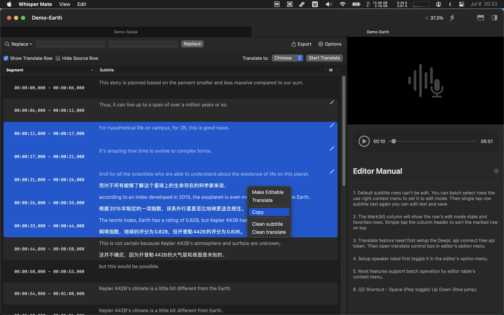

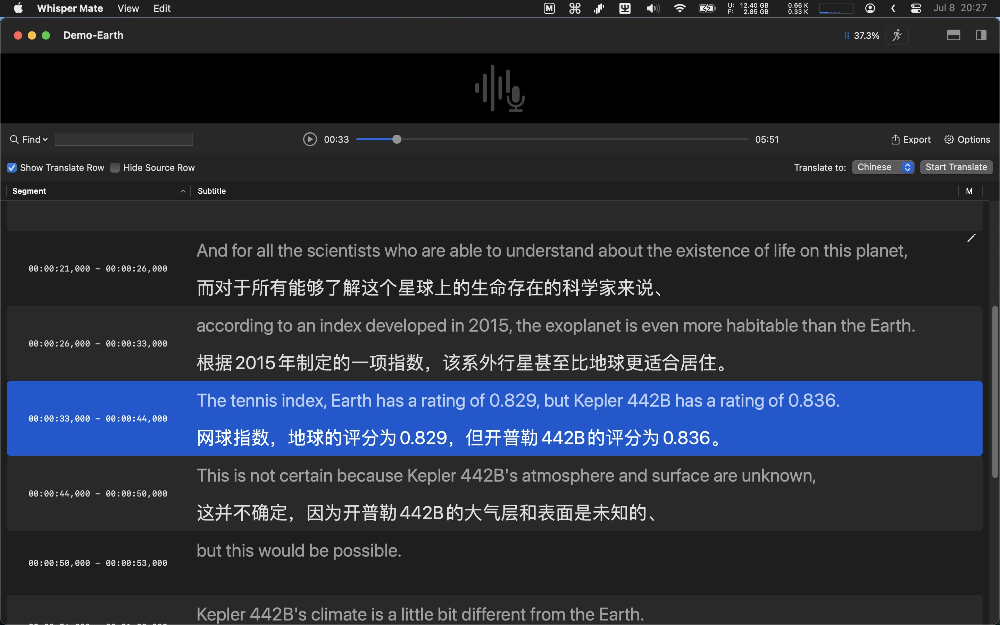

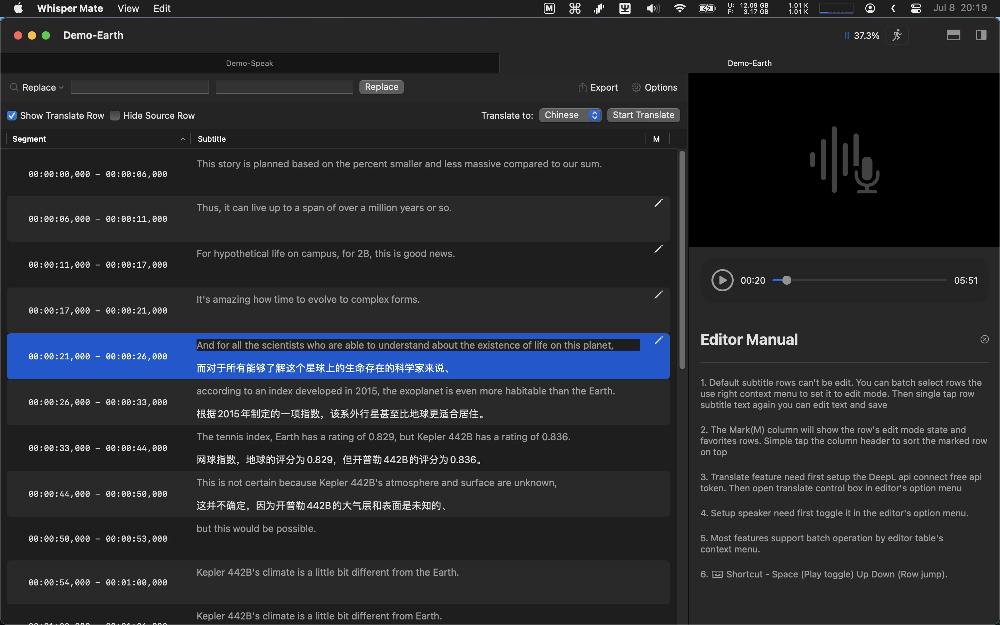

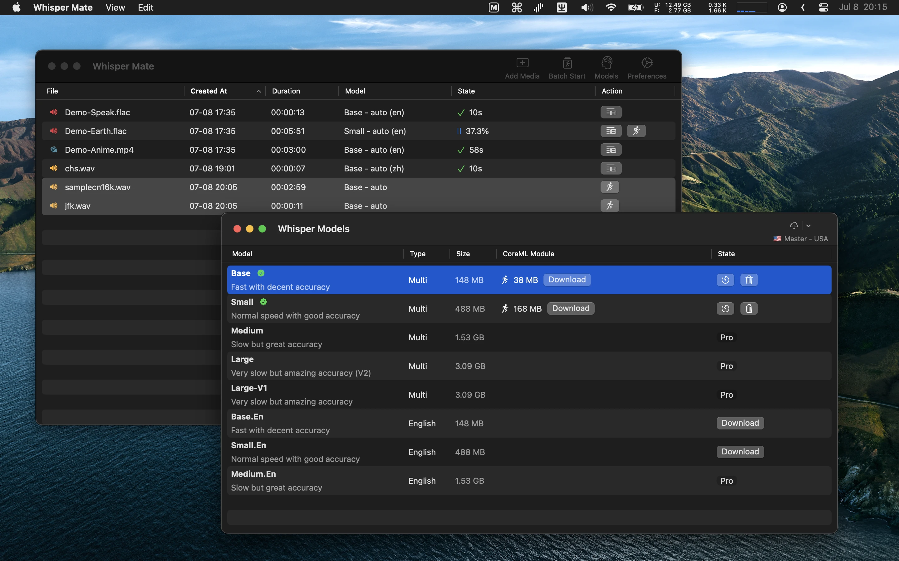

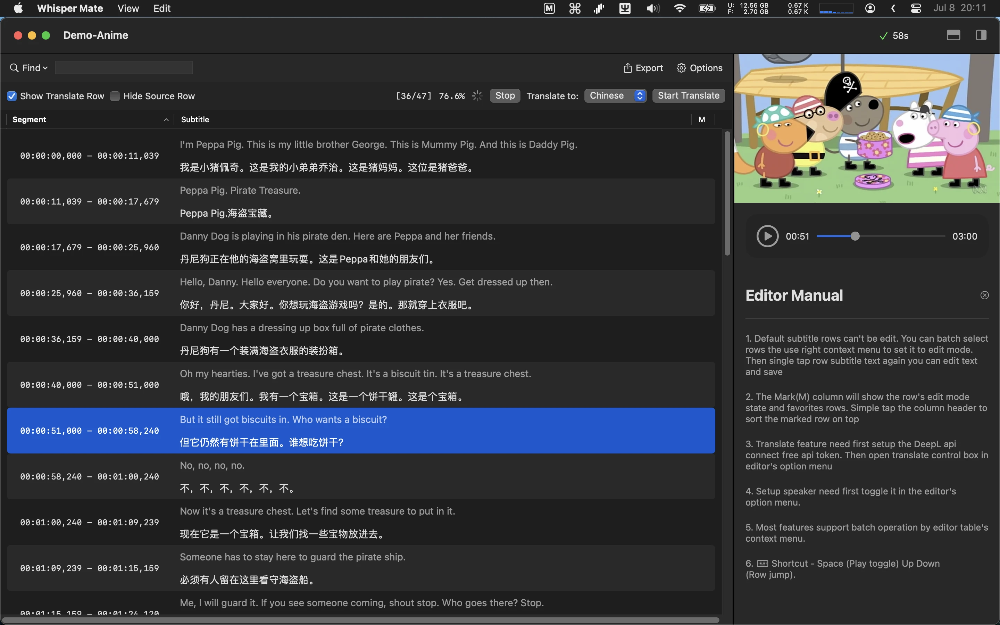

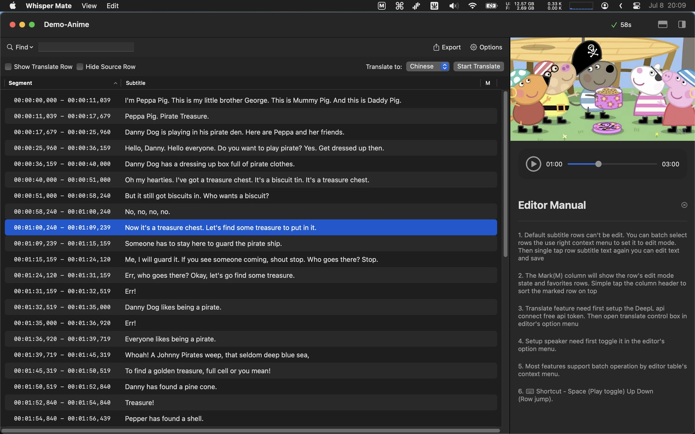

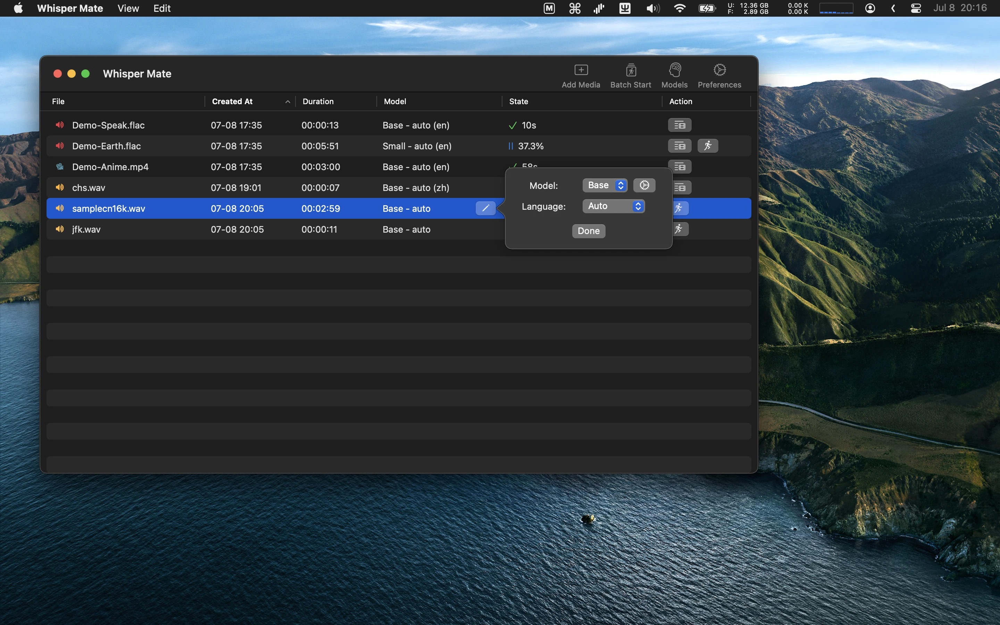

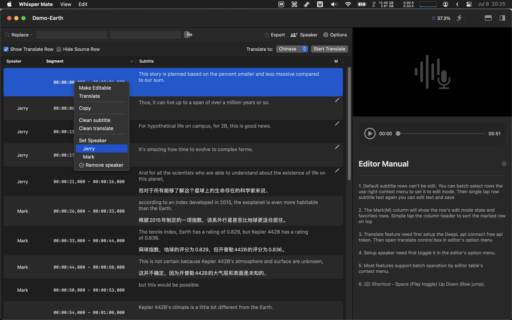

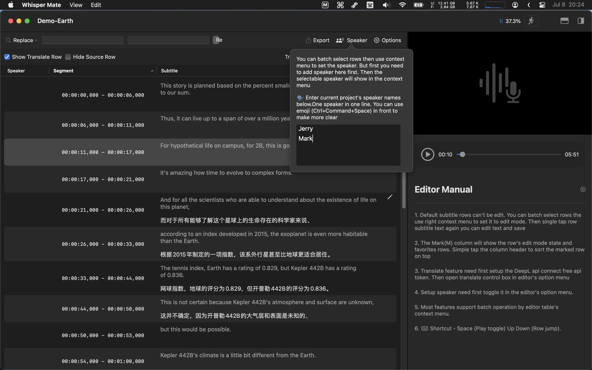

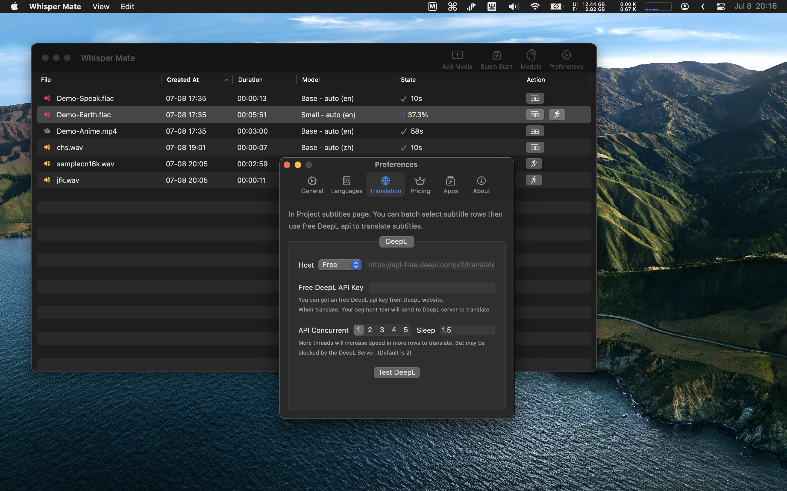

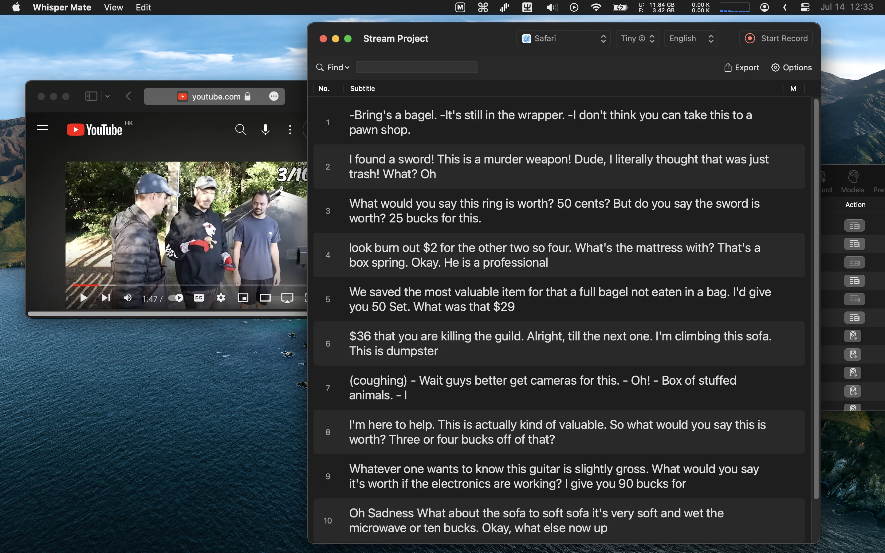

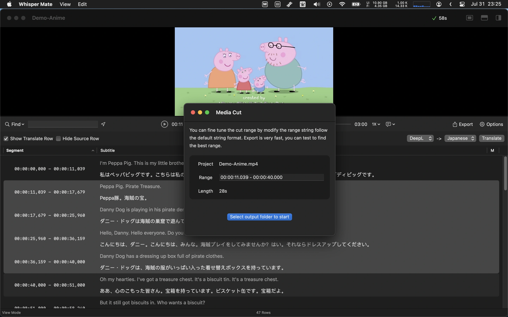

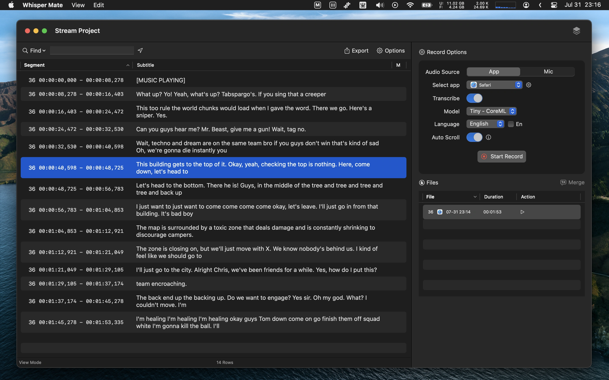

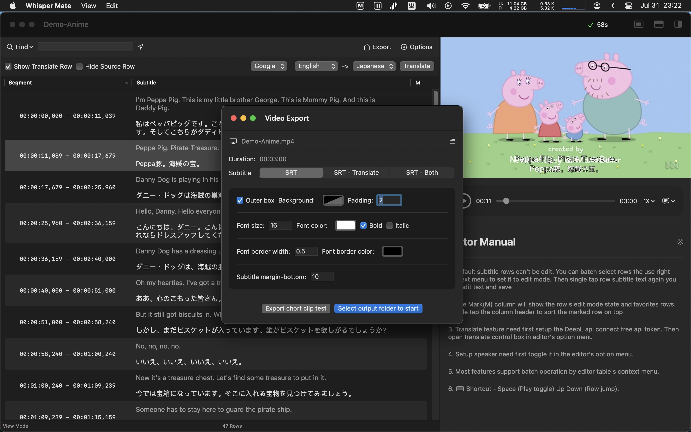

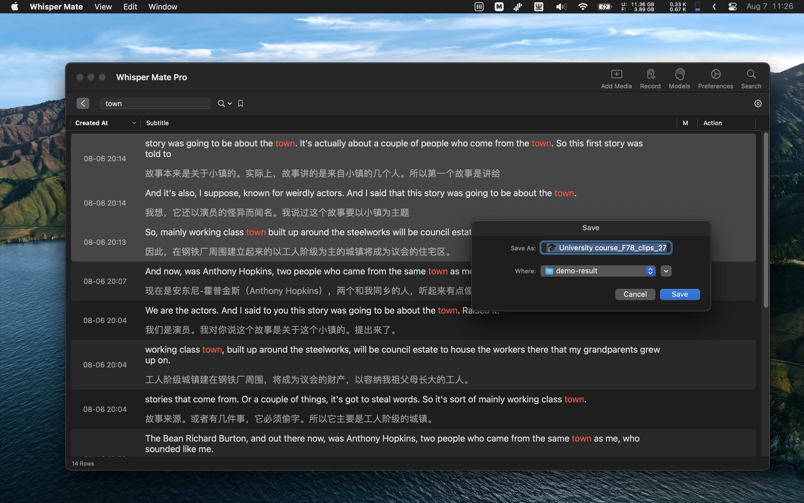

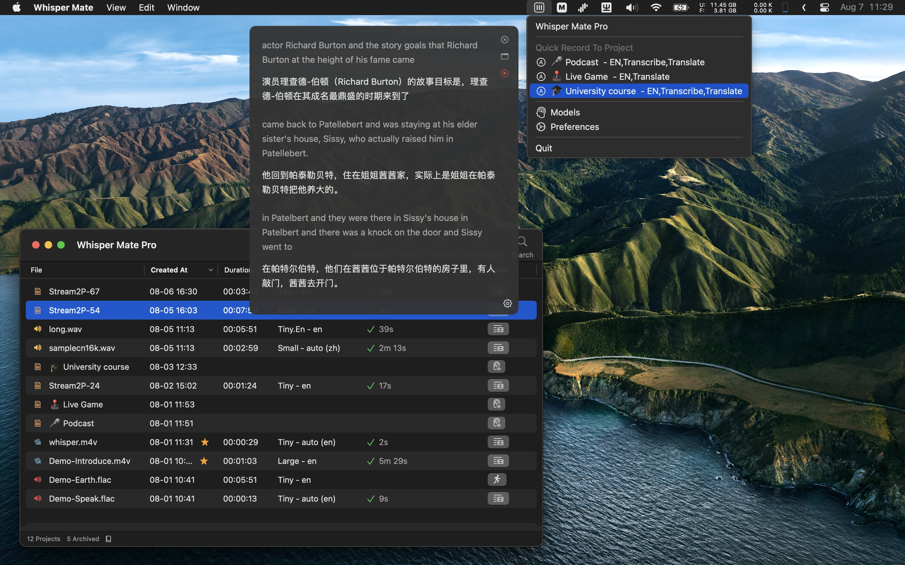