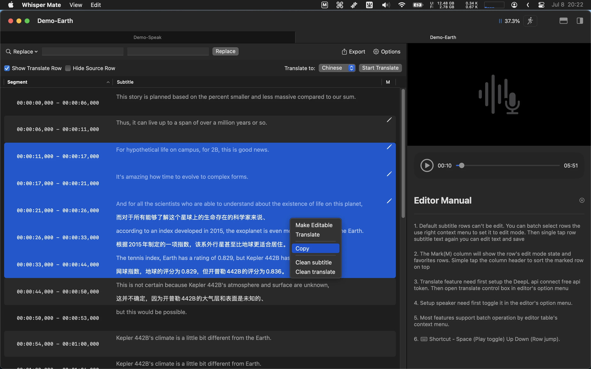
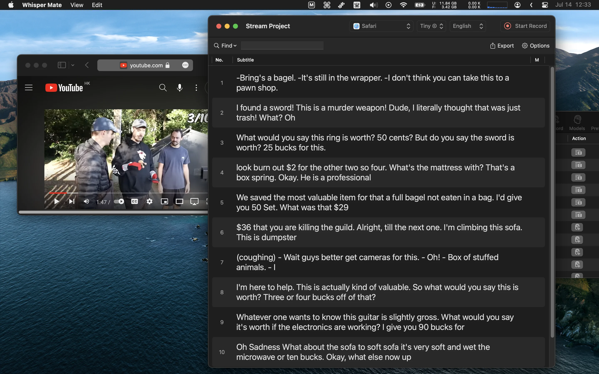

# README.md
- [Deutsch](README.de.md)
- [English](README.md)
- [Spanish](README.es.md)
- [Finnish](README.fi.md)
- [French](README.fr.md)
- [Italian](README.it.md)
- [Indonesian](README.id.md)
- [언어](README.ko.md)
- [日本語](README.ja.md)
- [简体中文](README.zh_cn.md)
- [繁体中文](README.zh_tw.md)
- [Norwegian](README.nb.md)
- [Dutch](README.nl.md)
- [Polish](README.pl.md)
- [Portuguese](README.pt_PT.md)
- [Swedish](README.sv.md)
- [ภาษาไทย](README.th.md)
- [Turkish](README.tr.md)
- [Ukrainian](README.uk.md)
- [Vietnamese](README.vi.md)

# 🎶 Fluistermaat - Spraak-naar-tekstconversie, lokale privacy met het Whisper-IA-model!

[Download de nieuwste versie van de Mac App Store](https://apps.apple.com/nl/app/id6450404233).

## Eigenschappen
Fluistermaat stelt je in staat om audio- en videobestanden in bulk om te zetten naar tekst met behulp van het Whisper-IA-model van OpenAI. Je kunt de ingebouwde teksteditor gebruiken om de conversieresultaten in secties weer te geven.
Het hele conversieproces wordt lokaal op je apparaat uitgevoerd en je privacy is beschermd.

V5.5.1
---
- Gelieve eventuele fouten in de geautomatiseerde vertaling te corrigeren nadat het project is voltooid.
- [148 MB](https://download.marksdo.com/apps/WhisperMate/V5.5.1/WhisperMate.dmg) 

V5.5.0
---
- Toegevoegde opties voor het Deepgram nova-2 model.
- Toegevoegd een pop-up venster waarin de gebruiker de transparantie kan aanpassen om real-time transcriptie te ondersteunen.
- Toegevoegde optie om alleen het vertaalresultaat weer te geven in real-time transcriptie.
- Toegevoegde optie om de stijl aan te passen (achtergrondkleur, tekstkleur) voor de real-time pop-up venster.
- Probleem opgelost waarbij automatiseringsinstellingen niet worden aangeroepen bij gebruik van het Deepgram transcriptiemodel.
- Probleem opgelost waarbij het venster voor real-time transcriptie soms open blijft.
- [148 MB](https://download.marksdo.com/apps/WhisperMate/V5.5.0/WhisperMate.dmg) 

V5.4.9
---
- Voeg de functie van het batchgewijs exporteren van projecttemplates toe, waarbij de resultaten van de geselecteerde projecten worden geëxporteerd naar één bestand vanuit het templatescript.
- Bugs opgelost en prestatieverbeteringen.
- [148 MB](https://download.marksdo.com/apps/WhisperMate/V5.4.9/WhisperMate.dmg) 

V5.4.8
---
- Voeg privacy-instellingen toe aan de statusbalk onderaan het hoofdvenster, hiermee kan evenementanalyse, crashrapporten en lokale logboeken worden uitgeschakeld.  
- Voeg een scriptvoorbeeld toe om rijen te verwijderen die aan bepaalde voorwaarden voldoen.  
- Voeg een scriptvoorbeeld toe om een ondertitelreeks als '(Muziek) * Muziek * [Muziek]' te vervangen door een lege reeks.  
- Voeg scriptfunctionaliteit toe om eigenschappen .memo .markWarn .warnMsg te wijzigen.  
- Voeg een instelling toe in de voorvertoningssubtitels om vertraging weer te geven.  
- Voeg een optie in de ondertitelbewerkingstoolkit toe om de start- of eindtijd van ondertitels in bulk te wijzigen.  
- Voeg een snelzoekfunctie toe in de ondertitelbewerker (⇧)+←→ om de voorvertoningssubtitels 5 seconden of 30 seconden vooruit te spoelen.  
- Voeg een luidsprekerbesturingsbalk toe en ondersteun snel instellen via sneltoetsen.  
- Verholpen probleem waarbij voorvertoningssubtitels niet konden worden verborgen.  
- Verholpen probleem waarbij tekst niet kon worden geknipt en geselecteerd in de sjablooneditor.  
- Verholpen probleem waarbij aangepaste sjabloon .t0f5 .t0f4 .t0f2 tijdsindeling nog steeds een getal met 3 cijfers in milliseconden retourneert bij het exporteren.
- [148 MB](https://download.marksdo.com/apps/WhisperMate/V5.4.8/WhisperMate.dmg) 

V5.4.7
---
- Voeg een optie toe om het project automatisch te starten wanneer er een bestand aan de projectlijst wordt toegevoegd (de schakelaar bevindt zich in de statusbalk onderaan het hoofdvenster)
- Voeg een automatiseringsstap toe om het bestand automatisch naar een aangepaste map te exporteren
- Voeg een automatiseringsstap toe om het resultaat naar je mailbox te mailen (het kan automatisch het vorige automatische exportresultaat als bijlage gebruiken)
- Upgrade de template- en JavaScript-editor om crashproblemen op te lossen.
- [148 MB](https://download.marksdo.com/apps/WhisperMate/V5.4.7/WhisperMate.dmg) 

V5.4.6
---
- Toevoegen van optie voor weergave van ondertitelindeling voor mediavoorbeeld, brontranscriptie en vertaalde ondertitel kunnen voor weergave naar boven of naar beneden gestuurd worden.
- Toevoegen van groot v3-coreml-model.
- Toevoegen van sneltoets ⌘+⌥+f of dubbel tikken op voorbeeld om snel over te schakelen naar volledig scherm.
- Sommige sneltoetsen ondersteunen nu het indrukken van een enkele letter om uit te voeren (samenvoegen, splitsen, aanpassen).
- Na samenvoegen wordt nu automatisch de eerste samengevoegde rij geselecteerd.
- Standaard toepassing voor het openen van audio- en videobestanden ontkoppeld van Whisper Mate.
- Oplossen van enkele crashes in V5.4.5.
- Oplossen van probleem met meldingsweergave.
- Oplossen van enkele vertaalproblemen.
- [123 MB](https://download.marksdo.com/apps/WhisperMate/V5.4.6/WhisperMate.zip) 

V5.4.5
---
- ❗ De universele versie moet mogelijk opnieuw worden gedownload. Omdat ik mijn ontwikkelingsapparaat heb geüpgraded en vergeten ben om de universele implementatie EDKey op te slaan.
- Voeg automatiseringsfunctie toe om taken uit te voeren wanneer het project is omgezet (Herhaalde secties samenvoegen/Snapshot/Script/Vertalen)
- Voeg optie toe voor maximale segmentlengte bij het omzetten
- Voeg voorbeelden toe van model prompts
- Voeg "vervang" toe met teken '\\n' (enkele schuine streep gevolgd door n) voor nieuwe regel in vervangfunctie
- Upgrade de interface voor project omzetopties configureren
- [122 MB](https://download.marksdo.com/apps/WhisperMate/V5.4.5/WhisperMate.zip)

V5.4.4
---
- Voeg een model cloud lijst toe aan het modelconfiguratiepaneel met ondersteuning voor 2 downloadhosts. (Wijzig naar host2 als het niet kan worden gedownload van host1)  
- Ondersteuning voor fallback gebruik van CoreML-module wanneer de optie GPU-versnelling is uitgeschakeld in de algemene instellingen  
- Probleem opgelost waarbij het downloaden van een groot model mislukt  
- Probleem opgelost waarbij de app crasht op apparaten zonder Apple silicon.
- [122 MB](https://download.marksdo.com/apps/WhisperMate/V5.4.4/WhisperMate.zip) 

V5.4.3
---
- Verbeter de snelheid van transcriberen.
- Ondersteuning toevoegen voor het fluisteren van het grote v3-model.
- Ondersteuning toevoegen voor de LibreTranslator-engine.
- Een duplicaatproject toevoegen aan het contextmenu van het project.
- Het veld "spreker" in de bewerkingsmodus (⌘+E) kan nu rechtstreeks worden ingevoerd.
- Het probleem met het tabbladvenster is opgelost wanneer het aantal tabbladen > 2 is.
- Het probleem met het crashen van het golfvormweergave soms is opgelost.
- Het probleem met het vertalen in de ondertitel editor, waar geselecteerde rijen niet kunnen worden vertaald, is opgelost.

V5.4.2
---
- Voeg een configuratie-optie toe voor het aantal verwerkingsdraden van Whisper. (Gebruik minder draden zodat de computer andere taken kan uitvoeren, maar de verwerkingstijd neemt toe)
- Voeg ondersteuning toe voor de Deepgram transcriptiemotor, ook ondersteuning voor realtime stream transcriptiemodus.
- Voeg een voorbeeldsjabloon toe voor het exporteren van alleen aangepaste sprekersinhoud.
- Voeg de mogelijkheid toe om te zoeken naar trefwoorden die beginnen met @ om sprekerrijen te filteren of alle sprekersnamen te vervangen door een andere naam (bijv. @tom --> jack).
- Voeg een functie toe om de configuratie van de recente project-sprekers op te slaan en opnieuw te gebruiken in een nieuw project.
- De aangepaste sjabloone

V5.4.1
---
- Voeg de functie voor extern beheer van de intranetwebpagina toe, gebruik uw telefoon of ander apparaat om bestanden toe te voegen om te verwerken en de verwerkingsstatus te bekijken (in de statusbalk onderaan het hoofdvenster).
- Voeg een sjabloonselector toe voor het configureren van AI-parameters.
- Voeg een AI-parameter toe om interpunctie te onderdrukken.
- Voeg JavaScript toe om synchronieke HTTP-verzoeken te gebruiken om gegevens op te halen of te verzenden (Je kunt het gebruiken om de gegevens van de ondertitelregel naar je lokale llm-service te sturen om de resultaten voor afleiding te verkrijgen en vervolgens terug te voegen naar de oorspronkelijke ondertitels, of om naar andere HTTP/HTTPS systeemservices te sturen. Bekijk het voorbeeld van HTTP in de JavaScript-processor om te zien hoe je het kunt gebruiken.)
- Los het foutbericht op bij het denoisen van een WAV-bestand wanneer het bestandspad spaties bevat.

V5.4
---
- Voeg snelknip functie toe
- Voeg sneltoets (c) toe om de ondertitel-editor voorbeeldspeler weer te geven of te verbergen
- Voeg sneltoets toe om de snelheid van de ondertitel-editor voorbeeldspeler te wijzigen
- Vervang de stille strategie door de chunk-strategie
- Verholpen bug met denoise-optie

### De nieuwe Quick Cut-functie heeft de volgende functionaliteiten:
- Visualiseer de audiogolfvorm om video's nauwkeurig te lokaliseren en bij te knippen.
- Split langere multimediabestanden in meerdere segmenten voor afzonderlijke verwerking vóór transcriptie.
- Gebruik de chunk-strategie om stille of niet-transcribeerbare segmenten over te slaan.
- Knip de segmenten die transcriptie vereisen afzonderlijk in individuele bestanden.

V5.3.1
---
- Voeg een prioriteitsattribuut toe aan de batchverwerkingswachtrij van projecten, waarbij hogere prioriteit als eerste wordt verwerkt (Optie is beschikbaar in het contextmenu)
- De functionaliteit voor het vervangen van ondertiteltekst vervangt ook overeenkomende zoekwoorden in vertaalde tekst
- Problemen met opnieuw transcriptie zijn opgelost door de stille overslaan-strategie toe te passen en het verminderen van ruis.

V5.3
---
- Voeg meer afgestemde modellen (klein/gemiddeld) toe voor talen.
- Voeg een transcribeerstrategie toe om stille segmenten over te slaan (geclassificeerd op decibels en stille duur).
- Voeg een optie toe om achtergrondgeluid te verminderen.
- Voeg een optie toe om transcribeer ondertitels voor de tijdcode te onderdrukken (geen spoiler).
- Voeg een voorbeeld van een JavaScript-processor toe om segmentondertitels te kapitaliseren.

V5.2
---
- Voeg fijnafgestelde modellen toe voor verschillende taalafleidingen. Kantonees/Chinees/Koreaans/Japans/Duits/Frans/Thais/Oekraïens...
- Voeg de mogelijkheid toe om lokale afgestemde Whisper AI-modellen toe te voegen aan Whisper Mate.
- Voeg de mogelijkheid toe om in één keer projectmodelparameters in te stellen.
- Voeg een optie toe om te voorkomen dat de screensaver start wanneer er een wachtrij actief is.
- Oplossing voor het probleem waarbij de taak werd gepauzeerd wanneer het systeemstartscherm werd geactiveerd.
- Oplossing voor het probleem waarbij het klikken op een rij in de ondertitelingseditor soms niet naar de positie van de speler kon navigeren.
- Oplossing voor het probleem waarbij tekstwijzigingen in de ondertitelingseditor niet ongedaan konden worden gemaakt of opnieuw konden worden gedaan vanuit het contextmenu.
- Oplossing voor het probleem waarbij bij batch-exporteren de combinatie van tijdsvolumes niet overeenkwam.

V5.1
---
• Voeg functie toe om projectsegmenten/srt/template in batch te exporteren met de optie om samen te voegen in één bestand.  
• Voeg functie toe om de geselecteerde rijen opnieuw te transcriberen met verschillende AI-parameters.  
• Voeg functie toe om tekstwijzigingen in ondertiteltekstinhoud ongedaan te maken of opnieuw uit te voeren met handmatige type wijzigingen (Sneltoetsen ⌘+Z ongedaan maken/⌘+⇧+Z opnieuw uitvoeren)  
• Voeg functie toe om nieuwe lege ondertitelrij onder geselecteerde rij toe te voegen (Sneltoetsen ⌘+N)  
• Voeg functie toe om project voltooiingsmelding via Slack inkomende webhook te verzenden. (U kunt melding op uw telefoon ontvangen wanneer elk project is getranscribeerd.)  
• Vaste media afspeelbedieningsvak locatie is niet gecentreerd bij Up-Down-stijl layout.

V5.0
---
- Kit toevoegen voor snel automatisch samenvoegen van ondertitels in opeenvolgende alinea's
- Aangepaste scriptprocessor toevoegen om de getranscribeerde ondertitels in batch aan te passen
- Ondertitelbewerker met tune-functie toevoegen. Het is vergelijkbaar met de functie voor splitsen en samenvoegen. U kunt meerdere rijen selecteren en ze in één tekstveld regel voor regel aanpassen.
- Ondertitelbewerker met meer sneltoetsenondersteuning toevoegen.
- Aangepast lettertype toevoegen aan de configuratie van de ondertitelweergave in de videovoorbeeldmodus.
- Aangepast lettertype toevoegen aan de configuratie van het branden van harde ondertiteling naar oorspronkelijke video.
- Exportondersteuning toevoegen voor pdf of docx, stel eenvoudig de exportachtervoegsel in op pdf of docx.
- Meer vooraf gedefinieerde exportvoorbeeldformaten toevoegen. U kunt voorbeelden laden en vervolgens een eenvoudige aanpassing van het sjabloonresultaat maken.
- Mogelijkheid toevoegen om momentopnamen te maken van de ondertitelstatus van het huidige project. U kunt dan eenvoudig teruggaan naar de opgeslagen momentopnamen.
- Mogelijkheid toevoegen om .srt te importeren naar het huidige project als momentopname.
- Optie toevoegen om de vertaalde tekst van de voorbeeldvideo ondertiteling over de brontekst weer te geven.
- Aangepaste exportfuncties toevoegen. Willekeurige getallen & willekeurige guid & escXML & vervangen van string met aangepast formaat.
- Aangepast exportuitvoertype toevoegen (bestand of klembord).
- Aangepaste exportoptie toevoegen om alle ondertitels te exporteren of alleen de geselecteerde.
- Optie toevoegen voor groeperen van venstergroepen van projecteditor met hoofdvenster.
- Extra configuratie van whisper-modelverwerkingsparameters toevoegen in modelselector (rechtsonder), kan moeilijk te vinden zijn. Omdat de meeste gevallen deze parameters niet hoeven te worden gewijzigd.
- Optimaliseren van schermvullende voorbeeldvideo-gedrag.
- Zoekwoordondersteuning of voorwaarde toevoegen (gebruik | als het OF-zoekwoord. Bijv./"hi|hello|hey").
- De zoek- en vervangingslogica optimaliseren. Bij vervangen wordt bij het zoeken naar trefwoorden de src-trefwoorden en vervangen trefwoorden getoond.
- Optimaliseer realtime stream transcriptielogica.
- Probleem opgelost met sommige subvensters die niet naar voren worden gebracht.
- Probleem opgelost met export xml-indeling.
- Probleem opgelost met sommige mislukte media-audiowinformaties.
- Probleem opgelost met automatisch uitvoeren van vervangingsactie bij verlaten van veld met vervangingszoekwoorden.
- Probleem opgelost met crash van streamproject.

V4.0
---
- Mogelijkheid toevoegen om de lay-outeigenschappen van de ondertitelbewerker van het project te onthouden. Elk project kan een andere lay-out en voorbeeldspelerformaat gebruiken. (oud project moet opnieuw worden geopend om de lay-outeigenschappen te onthouden)
- Optie toevoegen om gedupliceerde ondertitels in de bewerker te vinden.
- Contextmenu-optie toevoegen om de bewerker te openen, ook al is het transcriptiescript nog niet gestart.
- Ondertitels exporteren naar .sbv-indeling toevoegen.
- Aangepaste exporttemplates toevoegen (zoals .fcpxml, .itt, .ttml).
- Nieuwe plugin toevoegen.
- Optie toevoegen voor veelvoorkomende zoekwoorden en vervangende configuratie voor snelle hergebruik van zoeken of vervangen.
- Gemarkeerde rij weergeven als een markeervlag in de voortgangsweergave van de voorbeeldspeler.
- Optie toevoegen in contextmenu van ondertitelbewerker.
- Functie voor het splitsen van rijen toevoegen in de ondertitelbewerker bij het selecteren van een enkele rij.
- Weergave van projectnaam toevoegen in zoekresultaat.
- Optie toevoegen om de knop voor het lokaliseren van rijen in de bewerker te verbergen.
- Sneltoets ⌘+S toevoegen om snel .srt naar bestand te exporteren.
- Probleem opgelost waarbij audiokanaalmetadata twee audiokanalen ophaalde, terwijl er in werkelijkheid maar één was. (optionele optie om audiokanaalselectie te negeren)
- Probleem opgelost met mislukte ondertiteling bij handmatige wijziging projectnaam.
- Problemen opgelost met UI op macOS12.
- Problemen met statusbalkpictogram optie "stay on" oplossen.
- Problemen met UI-weergave in licht thema oplossen.

V3.5
---
- Functie toevoegen om audiofragmenten van ondertitels te downloaden. U kunt nu elke ondertitel selecteren en het audiofragment downloaden vanuit het contextmenu. Bij het selecteren van meerdere rijen wordt het automatisch samengevoegd tot één audiofragment.
- Kleine zwevende vensterstijl toevoegen voor realtime audio-opname.
- Snelstarten van opname van realtime stream naar project met nieuw zwevend venster in menubalkcontextmenu.
- Snel afspelen van audiosegment van een rijbereik in globaal zoekresultaat of direct het audiofragment van het zoekresultaat downloaden.
- Ondersteuning voor doorgaan van downloads toevoegen aan modellen.
- Ondertitelmemo-functies toevoegen, u kunt nu memo toevoegen aan een willekeurige ondertitel in de bewerker.
- Azure translate-optie toevoegen.
- Globale ondertitelzoekopdracht toevoegen in alle projecten.
- Zoekwoorden markeren in zoekresultaat toevoegen.
- Standaardsnelkoppelingen toevoegen voor snel bedienen van venster zoals Sluiten/Formaat/Minimaliseren.
- Optie toevoegen om de label van de hoofdwerkbalk te verbergen.
- Batch startknop verplaatsen van de hoofdwerkbalk naar het contextmenu.
- Probleem oplossen waarbij vervangen niet met een lege tekenreeks kan worden vervangen.
- Probleem oplossen met ontbrekende small & small-en modellen op back-upservers.
- Probleem oplossen met de locatie van de schuifregelaar van de afgespeelde audiobestanden.

V3.0
---
- Geselecteerde ondertitels exporteren naar een nieuw mediabestand met clipbereik.
- Video exporteren met harde ondertiteling naar oorspronkelijke video en aangepaste ondertitelstijl.
- Directe voorbeeldweergave van ondertitels in videovoorvertoning (ondertitelstijl kan worden aangepast in voorkeurspaneel).
- Audio opnemen via microfoon en realtime transcriptie ondersteunen (macOS13+).
- Ondertitels samenvoegen. Segmentbereik en ondertitel samenvoegen tot één rij.
- Automatisch opslaan van opgenomen audio naar bestand en omzetten naar een nieuw transcriptieproject.
- Optie toevoegen om ondertitelrij te dupliceren en deze inhoud of tijdbereik te wijzigen om volledige ondertitels te optimaliseren.
- Optie toevoegen om Whisper-vertaling naar het Engels in te schakelen in de projectmodelconfiguratie.
- Optie toevoegen om Whisper-prompttokenconfiguratie te gebruiken in de projectmodelconfiguratie.
- Optie toevoegen om automatisch scrollen van ondertitelrij uit te schakelen bij het voorbeeld van video.
- Ondersteuning voor aangepaste snelheid van media preview replay toevoegen.
- Ondersteuning voor ⌘+V om gekopieerde bestanden naar verwerkingswachtrij te plakken.
- Snel overschakelen naar bewerkingsmodus. Alle ondertitels kunnen worden weergegeven of bewerkt met sneltoetsen (⌘+E).
- Weergave van CPU-gebruikspercentage toevoegen bij Whisper-verwerking.
- Ondersteuning voor archiveren van projecten via contextmenu (Houd de lijst met werkende projecten schoon).
- Google-vertaling toevoegen aan ondertitelvertaling.
- Ondersteuning voor meer app-talen toevoegen.
- Volledige scherm media preview met ondertitelindeling.
- Ondersteuning voor het openen van mediabestanden via de optie 'openen met' van Finder.
- Snelheid van het renderen van grote hoeveelheid rijgegevens van ondertitelbewerker optimaliseren.
- Probleem opgelost met selectie van meerdere audiokanalen in video.
- Probleem oplossen met overslaan en verspringen van ondertitels tijdens het afspelen van video.

V2.0
---
- Ondersteuning voor het vastleggen en transcriben van audio in andere apps zoals (Zoom/Skype/Teams/Meetings App, alleen macOS13.0+).
- Plugin toevoegen voor batchconversie van ondertitels van vereenvoudigd Chinees naar traditioneel of andersom. (Eerst plugin activeren in voorkeurspaneel).
- Probleem oplossen waarbij projecteditor de spatie-sneltoets niet kan gebruiken om media afspelen of stoppen.
- Probleem oplossen met SRT- en VTT-exportindeling.

V1.0
---
- Audio- of videobestanden transcriberen.
- Gebruik van deepl free api voor het vertalen van ondertitels.
- Ingebouwde ondertitelbewerker om transcriptie te corrigeren.
- Exporteren naar SRT, VTT, CSV, JSON, SEGMENT.
- Ondersteuning voor het instellen van een spreker voor elke ondertitel.
- De meeste bewerkingen ondersteunen batchselectie. Zoals het uitvoeren van batchtaken, het vertalen van batchrijen en het instellen van luidsprekers voor batchrijen.
- Ondersteuning voor slepen en neerzetten van bestanden om de transcriptie te starten.
- Ondersteuning voor typen in zoektranscriptie.
- Ondertitelbewerker kan audiosynchronisatie met een audiobestand of videobestand weergeven.
- Ondersteuning voor meertalige conversie.
- Ondersteuning voor aangepaste veelgebruikte taal voor conversie of vertaling.

Functies

- Converteer audio- en videobestanden naar tekst
- Ondersteuning voor opname en conversie van spraak van opname- en andere applicaties (Zoom / Skype / Teams / andere applicaties, vereist schermopname van macOS 13.0 of hoger)
- Biedt gratis tekstvertaling met behulp van de DeepL API
- Ingebouwde ondertitelbewerkingstool
- Exporteren naar SRT, VTT, CSV, JSON, SEGMENT-formaat
- De mogelijkheid om elke ondertitel een naam te geven
- Veel functies ondersteunen samenwerking in een groep. Taken kunnen bijvoorbeeld als een groep worden uitgevoerd of vertalingen kunnen worden vertaald en toegewezen in bulk.
- Ondersteuning voor het slepen en neerzetten van bestanden voor ondertitelconversie
- Weergave van ondertitels tijdens het typen van tekst
- Voorbeeldweergave van het afspelen van audio- of videobestanden in de editor
- Mogelijkheid om geselecteerde ondertitels te exporteren als een nieuw mediabestand
- Ingevoegde ondertitels in het originele video met vooraf gedefinieerde of aangepaste stijl
- Directe weergave van ondertitels in het voorbeeldvenster (ondertitelinstellingen kunnen worden aangepast in de instellingen)
- Real-time tekstconversie tijdens het maken van een spraakopname (alleen macOS 13 en hoger)
- Ondersteuning voor het samenvoegen van ondertitelsegmenten - samenvoeging van segmentgebieden en ondertiteltekst in één enkele regel
- Programmaopnames worden automatisch opgeslagen en kunnen worden geconverteerd naar nieuwe conversieprojecten
- Kopieer ondertitelregels of wijzig de timing achtergrond
- Aangepaste afspeelinstellingen voor multimedia preview
- Ondersteuning voor de toetsenbordsnelkoppeling Cmd + V om bestanden in de wachtrij te plakken
- Weergave van CPU-gebruiksstatus tijdens audiobewerking
- Ondersteuning voor het maken van een archief vanuit het contextmenu (voor het opruimen van de actieve projectlijst)
- Ondersteuning voor Google Translate voor tekstvertaling
- Weergave van ondertitels in volledig scherm in multimedia preview
- Open multimedia presentatie vanuit het contextmenu
- Ondersteuning voor meertalige conversie of vertaalondersteuning voor veelgebruikte talen

## Afbeelding

