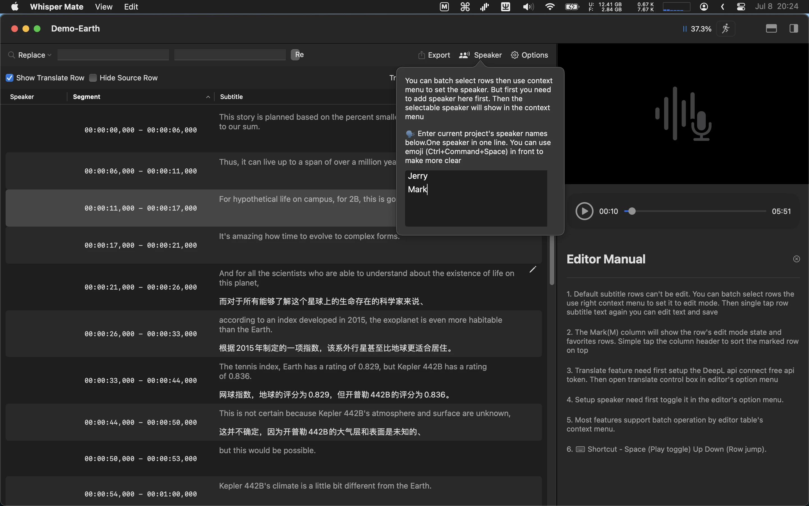

# README.md
- [Deutsch](README.de.md)
- [English](README.md)
- [Spanish](README.es.md)
- [Finnish](README.fi.md)
- [French](README.fr.md)
- [Italian](README.it.md)
- [Indonesian](README.id.md)
- [언어](README.ko.md)
- [日本語](README.ja.md)
- [简体中文](README.zh_cn.md)
- [繁体中文](README.zh_tw.md)
- [Norwegian](README.nb.md)
- [Dutch](README.nl.md)
- [Polish](README.pl.md)
- [Portuguese](README.pt_PT.md)
- [Swedish](README.sv.md)
- [ภาษาไทย](README.th.md)
- [Turkish](README.tr.md)
- [Ukrainian](README.uk.md)
- [Vietnamese](README.vi.md)

# 🎶 WhisperMate - Yerel Duyarlılıkla Sese Yazıya Dönüştürmek için Whisper AI Modelini Kullanın!

[En son sürümü Mac App Store'dan indirin](https://apps.apple.com/pl/app/id6450404233).

## Özellikler
WhisperMate, Whisper AI modelini kullanarak ses ve video dosyalarını metne dönüştürmenize yardımcı olur. Mevcut metin düzenleyicisini kullanarak dönüşüm sonuçlarını görmek için uygulamada bulunan her bölümü kullanabilirsiniz
Tüm bu dönüşüm işlemleri cihazınızda gerçekleşir ve verilerinizin gizliliğine dikkat eder.

V5.5.1
---
- Lütfen proje tamamlandıktan sonra otomatik çeviri hatalarını düzeltin.
- [148 MB](https://download.marksdo.com/apps/WhisperMate/V5.5.1/WhisperMate.dmg) 

V5.5.0
---
- Deepgram nova-2 model seçeneği eklendi.
- Gerçek zamanlı konuşma işleme için şeffaflık ayarlama seçeneği eklendi.
- Sadece gerçek zamanlı çeviri sonuçlarını gösterme seçeneği eklendi.
- Gerçek zamanlı uygulama penceresinde arka plan ve metin rengi özelleştirme seçenekleri eklendi.
- Deepgram modeli kullanılırken otomatik yapılandırma ayarlarının dikkate alınmaması sorunu düzeltildi.
- Gerçek zamanlı kaydırma penceresinin açık kalma sorunu düzeltildi.
- [148 MB](https://download.marksdo.com/apps/WhisperMate/V5.5.0/WhisperMate.dmg) 

V5.4.9
---
- Toplu dışa aktarma projeleri şablon özelliği eklendi, şablondan seçilen projelerin sonuçlarını tek bir dosyaya aktarabilir.  
- Hata düzeltmeleri ve performans iyileştirmeleri yapıldı.
- [148 MB](https://download.marksdo.com/apps/WhisperMate/V5.4.9/WhisperMate.dmg) 

V5.4.8
---
- Ana pencere alt durum çubuğuna gizlilik ayarları ekle, etkinlik analitiğini devre dışı bırakabilirsiniz ve çökme raporunu ve yerel günlüğü  
- Koşulları karşılayan satırları silme komutu örneği ekleyin  
- Metin içindeki '(Müzik) * Müzik * [Müzik]' gibi alt başlığı boş dizeyle değiştirmek için bir komut örneği ekleyin  
- .memo .markWarn .warnMsg niteliklerini yazdıran komut örneği ekleyin  
- Önizleme alt yazı gecikme görüntüleme seçeneği ekleyin  
- Alt yazı düzenleyici araç takımıyla toplu olarak alt başlık başlangıç ​​veya bitiş saatini değiştirme seçeneği ekleyin  
- Alt yazı düzenleyicide (⇧)+←→ kısayolunu ekleyerek hızlı önizlemeye 5 saniye veya 30 saniye atlama  
- Konuşmacı kontrol çubuğunu ekleyin ve kısayollarla hızlı ayarlama desteği sağlayın  
- Önizleme alt yazıları gizlenememe sorununu düzeltildi  
- Şablon düzenleyicisi metni panoya kopyalayamama ve sürükle bırakla seçememe sorunu düzeltildi  
- Özel şablon .t0f5 .t0f4 .t0f2 zaman aralığı formatında hala 3 basamaklı milisaniye döndürme hatası düzeltildi
- [148 MB](https://download.marksdo.com/apps/WhisperMate/V5.4.8/WhisperMate.dmg) 

V5.4.7
---
- Projeye dosya eklendiğinde otomatik başlama proje seçeneği ekle (ana pencere alt durum çubuğunda ayar düğmesi bulunur)  
- Otomatik olarak dosyayı özel klasöre aktarma adımı ekle  
- Sonucu e-posta ile otomatik olarak posta kutunuza gönderme adımı ekle (önceki otomatik dışa aktarma sonucunu ek olarak otomatik olarak kullanabilir)  
- Şablonu ve java script düzenleyicisini yükseltin, çökme sorunlarını düzeltmek için
- [148 MB](https://download.marksdo.com/apps/WhisperMate/V5.4.7/WhisperMate.dmg) 

V5.4.6
---
- Medya önizleme altyazı düzeni seçeneği, kaynak metin ve çevrilmiş altyazıyı yukarı veya aşağı doğru kontrol etme özelliği eklendi.  
- Büyük v3 coreml modeli eklendi.  
- Tam ekrana hızlı geçiş için kısayol ⌘+⌥+f veya önizlemeye çift tık eklenmiştir.  
- Bazı kısayollar artık (birleştirme, bölme, ayarlama) tek tuşla çalışmayı desteklemektedir.  
- Altyazı birleştirdikten sonra, otomatik olarak birleştirme sırasındaki ilk satır seçilir.  
- Ses ve video dosyaları için varsayılan açılış uygulaması ile whisper mate bağlantısı iptal edildi.  
- V5.4.5 sürümünde bazı çökme hataları düzeltildi.  
- Bildirim görüntüleme sorunu düzeltildi.  
- Bazı çeviri sorunları düzeltildi.
- [123 MB](https://download.marksdo.com/apps/WhisperMate/V5.4.6/WhisperMate.zip) 

V5.4.5
---
- ❗ Universal Sürümü tekrar indirilmemiz gerekebilir. Geliştirme cihazımı yükselttim ve Universal dağıtım EDKey'i kaydetmeyi unuttum.
- Projeyi transkribe etme işlemi tamamlandığında otomasyon özelliği ekleyin (Tekrarları birleştirme / Anlık görüntü / Komut dosyası / Çeviri).
- Maksimum segment uzunluğu transkribe seçeneğini ekleyin.
- Model ipucu örnekleri ekleyin.
- Değiştirme özelliğinde '\n' karakteriyle (tek ters böl) yeni satırda değiştirme ekleyin.
- Proje transkribe seçenekleri yapılandırma arayüzünü güncelleyin.
- [122 MB](https://download.marksdo.com/apps/WhisperMate/V5.4.5/WhisperMate.zip)

V5.4.4
---
- Model yapılandırma paneline, 2 indirme sunucu desteğiyle model cloud listesini ekleyin. (Host1'de indiremezseniz Host2'yi deneyin)  
- Genel ayarlarda GPU hızlandırma seçeneği devre dışı bırakıldığında CoreML modülü kullanılarak geri düşme sağlanır.  
- Büyük model indirme hatası düzeltildi.  
- Apple silikon cihazlarda çökme sorunu düzeltildi.
- [122 MB](https://download.marksdo.com/apps/WhisperMate/V5.4.4/WhisperMate.zip) 

V5.4.3
---
- Transcribe hızını artır
- Whisper büyük v3 modeline destek ekle
- LibreTranslator motoru desteği ekle
- Proje bağlam menüsüne proje kopyala ekle
- Düzenleme modunda (⌘+E) hoparlör alanına doğrudan giriş yapabilme güncelle
- Sekmeli pencere sayısı > 2 olduğunda yaşanan sorunu düzelt
- Dalga formu görünümünde zaman zaman çökme yaşanan sorunu düzelt
- Altyazı düzenleyicide seçili satırları çevirememe sorununu düzelt

V5.4.2
---
- Yapılandırma aşısı süreci iş parçacığı sayısı seçeneği ekle. (Daha az iş parçacığı kullanarak bilgisayara başka işler yapma izni verin, ancak işleme süresi artacaktır)
- Derinbank transkript motor desteği ekle, ayrıca gerçek zamanlı akış transkript modunda da destekle.
- Yalnızca özel konuşmacı içeriği için şablon örneği ekleyin.
- Konuşmacı sıralarını filtrelemek veya tüm konuşmacı adlarını başka bir adla değiştirmek için @ ile başlayan arama anahtarını ekleyin (örneğin: @tom -->jack).
- Son projenin konuşmacı yapılandırmasını kaydetme ve yeni projede yeniden kullanma özelliği ekle.
- Özel şablon dışa aktarma şu anda 9 özel şablona destek ekleyin.

V5.4.1
---
- İç ağ web uzaktan yönetim özelliği ekle, telefonunuz veya başka bir cihaz kullanarak dosya ekleyin ve işleme durumunu görüntüleyin (Ana pencere alt durum çubuğunda)
- AI parametre yapılandırma şablonu seçici ekle. 
- Noktalama işaretini bastırma AI parametresini ekle
- JavaScript'i ekleyin, veri almak veya göndermek için senkronizasyonlu http isteği yapmak için kullanın (Subtitle satır verilerini yerel llm servisinize gönderip düzeltme sonucunu almak ve ardından orijin altyazıya geri doldurmak veya diğer http/https sistem servisine göndermek için kullanabilirsiniz, nasıl kullanılacağını görmek için javascript işlemciden örnek http yükleyin).
- Dosya yolunda boşluk karakteri bulunduğunda gürültüyü giderme işlemini düzeltin

V5.4
---
- Hızlı kesim özelliği ekle  
- Alt yazı düzenleyici önizleme oynatıcısını göstermek veya gizlemek için (c) kısayolunu ekle  
- Alt yazı düzenleyici önizleme oynatıcı hızını değiştirmek için kısayol ekle  
- Sessiz stratejisini parça stratejisi ile değiştir  
- Gürültü giderme seçeneği hatası düzeltildi  
  
### Yeni Hızlı Kesim özelliği aşağıdaki işlevlere sahiptir:  
- Videoları hassas bir şekilde konumlandırmak ve kırpma işlemi yapmak için ses dalga formunu görselleştirir.  
- Transkript öncesi, uzun multimedya dosyalarını ayrı işleme tabi tutmak için parçalara böler.  
- Sessiz veya transkript edilemeyen bölümleri atlamak için parça stratejisini kullanır.  
- Transkript gerektiren bölümleri ayrı ayrı dosyalara kırpma işlemi yapar.

V5.3.1
---
- Partiye öncelik özelliği ekleme işlemi sırasında proje önceliğini de ekleyin (Seçenek, bağlam menüsünde bulunur).
- Altyazı metni değiştirme özelliği, çevrilen metinde eşleşen anahtar kelimeyi de değiştirir.
- Sessiz stratejiyi atla ve gürültü sorunlarını azaltarak yeniden transkript sorununu düzeltin.

V5.3
---
- Diller için daha fazla ayarlanmış model (küçük/orta) ekleyin. 
- Sessiz bölümü atlamak için transkribe stratejisi ekleyin (desibel ve sessizlik süresi ile sınıflandırılmış). 
- Arka plan gürültüsünü azaltma seçeneği ekleyin. 
- Transkripte başlıkları zaman damgasından önce göstermeyi bastırmak için seçenek ekleyin (spoiler yok). 
- Segment başlığını büyük harfle yazmak için örnek javascript işlemcisini ekleyin.

V5.2
---
- Farklı dil çıkarımları için ince ayarlı modeller ekleyin. kantonca/zh/ko/jp/de/fr/th/uk...  
- Whisper Mate'e yerel ayarlı Whisper AI Modeli ekleme özelliği ekleyin.  
- Projeye toplu olarak model parametrelerini ayarlama özelliği ekleyin.  
- Çalışan bir sıraya sahipken ekran koruyucu başlamasını önlemek için seçenek ekleyin.  
- Sistem ekran koruyucusu başladığında işlem durdu sorunu düzeltildi.  
- Altyazı düzenleyicide bazen satır tıklamasıyla oynatıcı konumuna gidilememesi düzeltildi.  
- Altyazı düzenleyicide değiştirilen metni geri alıp yeniden yapma işlemi, sağ tıklama menüsünden çağrılamaması düzeltildi.  
- Toplu dışa aktarma işleminde süre aralığı eşleşmediğinde düzeltildi.

V5.1
---
- Projelerin bölüm/srt/şablonlarını toplu olarak dışa aktarma seçeneği ve bir dosyada birleştirme seçeneği ekle  
- Seçilen satırları farklı ai parametreleri ile yeniden transkribe etme özelliği ekle  
- Altyazı metin içeriğinde manuel yazma değişikliği ile metin değişikliğini geri alma veya yeniden yapma özelliği ekle (Kısayoller ⌘+Z geri al / ⌘+⇧+Z yeniden yap)  
- Seçilen satırın altına yeni boş altyazı satırı ekleme özelliği ekle (Kısayol ⌘+N)  
- Projenin transkripti bittiğinde Slack gelen webhook üzerinden proje tamamlandı bildirimi gönderme özelliği ekle. (Her projenin transkripsiyonu bittiğinde telefonunuzda bildirim alabilirsiniz)  
- Up-Down stil düzeninde medya oynatma kontrol kutusu konumunun merkeze hizalanmaması sorunu giderildi

V5.0
---
- Ardışık paragraflardaki altyazıları hızlı bir şekilde birleştirmek için bir kiti ekle
- Transkripsiyonlu altyazıları toplu olarak ayarlamak için özel bir betik işleyici ekle
- Benzer şekilde bölme ve birleştirme özelliği olan bir altyazı düzenleyici ayarlama özelliği ekle. Birden fazla satırı seçip bunları tek bir metin alanının satır satır ayarlamasına izin verir.
- Daha fazla kısayol desteğine sahip bir altyazı düzenleyici ekle.
- Önizleme video altyazı stil yapılandırma panelinde özel yazı tipi ekle.
- Köken video yapılandırma panelinde özel yazı tipi yakma altyazı ekle
- PDF veya docx çıkarma desteği ekle, basitçe çıkarma eki pdfor docx olarak ayarlayın
- Daha fazla önceden tanımlanmış çıkış örnek formatı ekle. Örnekteki yükleyebilir ve ardından basit bir şablon sonucunu ayarlayabilirsiniz.
- Geçerli projenin altyazı durumlarının anlık görüntülerini oluşturma özelliği ekle. Daha sonra kaydedilmiş anlık görüntülere kolayca geri dönmeyi sağlar.
- Geçerli projeye .srt yükleme özelliği olarak anlık görüntü olarak ekle.
- Önizleme video altyazı görüntüleme tercüme edilmiş metni kaynak metnin üzerine gösterme seçeneğini ekle.
- Özel ihracat işlevleri ekle. Özel bir biçimle random numbers & random guid ve escXML ve replaceString ile çıktı alabilirsiniz
- Özel ihracat çıktı türü (dosya veya panoya) ekle.
- İhracat için tüm altyazıları kullanarak mı yoksa sadece seçilmiş olanları mı kullanmak istediğini seçmek için özel ihracat seçenekleri ekle.
- Ana pencere seçeneği ile projeyi düzenleme penceresi grubunu ekle
- Model seçicisinde ekstra fısıltı model işlem parametreleri yapılandırma özelliği ekleyin (sağ alt köşede), çoğu durumda bu parametreleri değiştirmek gerekli değildir, bu nedenle bulması kolay değildir.
- Tam ekran önizleme video davranışlarını optimize et
- Anahtar kelime arama desteği veya koşul desteği (veya anahtar kelime olarak | olarak kullanır. örneğin "hi | hello | hey") ekle
- Arama ve değiştirme mantığını optimize et. Değiştirme işlemi sırasında anahtar kelime arama anahtar kelimeleri göstermek ve değiştirilen anahtar kelimeleri ayarlamak için ayarlanır.
- Gerçek zamanlı akış transkripsiyon mantığını optimize et
- Bazı alt pencere ön plana çıkarma sorunlarını düzeltin
- XML formatında bazı hata düzeltmeleri yapın
- Bazı medya çıkarma wav başarısız işlemlerini düzeltin
- Replace anahtar kelime alanını boşaltma otomatik değiştirme eylemi sorununu düzeltin
- Akış projesinde bazı çökme sorunlarını düzeltin

V4.0
---
- Proje alt başlığı düzenleyicisinin düzen özelliklerini hatırlama özelliği eklenmiştir. Her projede farklı bir düzen ve önizleme oynatıcı boyutu kullanılabilir. (eski projeleri tekrar açmak düzen özelliklerini hatırlar)
- Düzenleyicide tekrarlanan alt başlık bulma seçeneği eklenmiştir.
- Transkript script işlemi başlamamış olsa bile düzenleyiciyi açmak için bağlam menüsü seçeneği eklenmiştir.
- Altyazıları .sbv formatında dışa aktarma seçeneği eklenmiştir.
- Özel dışa aktarma şablonu özellikleri eklendi (örneğin .fcpxml, .itt, .ttml).
- Yeni eklenti eklendi.
- Hızlı arama veya değiştirme için sık kullanılan anahtar kelimeleri ve yerine koyma yapılandırma seçeneği eklendi.
- İşaretlenen satır, önizleme oynatıcının ilerleme görünümünde bir İşaret işareti gösterme özelliği eklendi.
- Altyazı düzenleyici bağlam menüsüne işaret seçeneği eklendi.
- Tek satır seçildiğinde altyazı düzenleyicide satır bölme özelliği eklendi.
- Arama sonuçları satırda proje adının gösterilmesi özelliği eklendi.
- İleri işlem medyası hata ile karşılaştığında hata bilgisi görüntüleme seçeneği eklendi.
- Düzenleyici konum satır düğmesini gizleme seçeneği eklenmiştir.
- .srt dosyasını hızlı bir şekilde dışa aktarmak için ⌘+S kısayolu eklendi.
- Medya kanalı ses meta bilgisi iki ses kanalı alsa da aslında bir ses kanalı olur. (ses kanalı seçimini görmezden gelme seçeneği eklendi)
- Proje adı manuel olarak değiştirildiğinde altyazı yakma hatası düzeltildi.
- macOS12'de bazı arayüz sorunları düzeltildi.
- Sabitlenen özelliği devre dışı bırakılmış olsa bile durum çubuğu simgesini kilitlemeyen sorun düzeltildi.
- Bazı açık temalarında arayüzün düzgün görüntülenmediği sorunu düzeltildi.

V3.5
---
- Altyazı ses klibi indirme özelliği eklendi. Artık herhangi bir altyazı seçebilir ve bağlam menüsünü kullanarak ses klibini indirebilirsiniz, çoklu satırlar seçildiğinde otomatik olarak birleştirilerek bir ses klibine dönüştürülür.
- Gerçek zamanlı ses yakalamada küçük kayan pencere stili eklendi.
- Menü çubuğunda, hızlı bir şekilde projeye kayıt akışı başlatmak için context menüsü kullanılabilir hale getirildi.
- Global arama sonuçlarında veya arama sonucu ses aralık klibini doğrudan indirme durumunda hızlı bir şekilde bölüm satırı aralığında ses oynatma özelliği eklendi. 
- Şimdi Modeller indirme işlemi, kırılmaya devam eden işlemleri desteklemektedir.
- Altyazı hatırlatma özellikleri eklendi, artık düzenleyicide herhangi bir altyazıya hatırlatma ekleyebilirsiniz.
- Azure translate seçeneği eklendi.
- Tüm projelerde global altyazı arama özelliği eklendi.
- Arama sonuçlarında arama kelimelerini vurgulama özelliği eklendi.
- Kapatma/Büyütme/Küçültme gibi hızlı kontrol penceresi için varsayılan kısayollar ekleme seçeneği eklendi.
- Ana araç çubuğunun etiketini gizleme seçeneği eklendi.
- Toplu başlatma düğmesi ana araç çubuğundan context menüye taşındı.
- Değiştirme işleminde boş dize ile değiştirme yapılamama sorunu düzeltildi.
- Yedek sunucularda küçük & küçük-en modellerinin eksik olma sorunu düzeltildi.
- Kaydedilmiş ses dosyası oynatıcısının kaydırıcı konumu alt yazı sorunu düzeltildi.

V3.0
---
- Seçilmiş altyazıların medya aralığını yeni bir medya klibi dosyasına aktarın
- Yanmış altyazılı videoyu orijinal videoya ve özel altyazı stiline ekleyerek videoyu dışa aktarın
- Videonun önizlemesinde altyazıyı doğrudan önizleme edin (tercih panelinde altyazı stili özelleştirebilirsiniz)
- Mikrofon sesini kaydetmeyi ve gerçek zamanlı transkribe desteği sağlamayı ekleyin (macOS13+)
- Altyazı birleştirme özelliklerini ekleyin. Segment aralığı ve altyazı bir satırda birleştirilecek.
- Uygulama sesini kaydetme özelliği otomatik olarak dosyaya kaydedecek ve yeni bir transkribe projesine dönüştürülebilecek.
- Altyazı satırını kopyalama seçeneğini ekleyin ve tam altyazıyı hassas ayarlamak için içeriğini veya zaman aralığını değiştirmeye izin verin.
- İngilizce'ye gömülü çeviriyi etkinleştirme seçeneği projelerin yapılandırma panelinde
- Projelerin yapılandırma panelinde fısıltı ipucu belirteci yapılandırmasını kullanma seçeneği ekleyin
- Video önizleme sırasında altyazı satırının otomatik kaydırma özelliğini devre dışı bırakma seçeneği ekleyin
- Medya önizleme tekrarlama hızını özelleştirme desteği ekleyin
- ⌘ + V ile kopyalanan dosyaları işlem sırasına yapıştırma desteği ekleyin
- Hızlı düzenleme moduna hızlı geçiş yapma seçeneği ekleyin. Tüm altyazılar kısayol (⌘ + E) kullanarak düzenlenebilir veya görüntülenebilir.
- Fısıltı işlenirken CPU kullanım yüzdesi görüntüleme ekle
- Projeleri sağ tık menüsü ile arşivleme desteği ekleyin (Çalışma projeleri listesini temiz tutun)
- Altyazı çeviri kontrolünde Google çevirisini ekleyin
- Daha fazla uygulama dilini destekleyin
- Altyazı düzenleyiciyi büyük veri satırlarının render hızında optimize edin
- Çoklu ses kanalı video seçme sorununu düzeltin
- Önizleme ve düzenleyici altyazı atlama ve video kaydırma sorununu düzeltin

V2.0  
---  
- Zoom/Skype/Teams/Toplantı Uygulaması gibi diğer uygulamalarda sesi kaydetme ve transkript yapmayı destekleme (yalnızca macOS13.0+ için)  
- Çinceden gelen altyazıları geleneksel hale veya tersten dönüştürmek için eklenti ekleme (tercih panelinde ilk önce eklentiyi etkinleştirmeniz gerekmektedir)  
- Proje düzenleyicinin ortamı oynatmak veya durdurmak için boşluk kısayolu kullanamama sorununu düzeltme  
- SRT ve VTT dışa aktarma formatı hatasını düzeltme  
  
V1.0  
---  
- Ses veya video dosyalarını transkript etme  
- Deepl ücretsiz API'ını kullanarak altyazıları çevirme  
- Transkript düzeltmek için altyazı düzenleyiciyi gömme  
- SRT, VTT, CSV, JSON, SEGMENT olarak dışa aktarma  
- Her altyazıya konuşmacı atama desteği  
- Çoğu işlemi toplu seçim için destekleme. Toplu görev çalıştırma gibi toplu satır çevirme, toplu satır konuşmacı atama  
- Transkript başlatmak için dosyaları sürükleyip bırakmayı destekleme  
- Arama metnine yazma desteği  
- Düzenleyici, oynatma aralığını eşitlemek için ses veya video dosyasını önizleme yapabilir  
- Çoklu dil dönüşümünü destekleme  
- Dönüştürme veya çevirme için sık kullanılan özel dil desteği

Özellikler

- Ses ve video dosyalarını metne dönüştürme
- Kayıt yapma ve Zoom / Skype / Teams / diğer uygulamalardan konuşma dönüştürme (macOS sürüm 13.0 veya üzeri gerektirir)
- DeepL API kullanarak ücretsiz çeviri
- Yazılım içinde gömülü altyazı düzenleme araçları
- SRT-, VTT-, CSV-, JSON-, SEGMENT formatlarına dışa aktarma
- Ek altyazı adı verme seçeneği
- Eşzamanlı çalışmalarda birçok fonksiyonun desteklenmesi, örneğin toplu dönüşüm veya grup çalışması ve kayıt ve analiz
- Altyazı dönüştürmek için dosyaları sürükleyip bırakma desteği
- Metin yazarken altyazıyı görüntüleme
- Düzenleyicide ses veya video dosyasının örneğini oynatma
- Seçili altyazıyı yeni medya dosyası olarak dışa aktarma
- Önceden belirlenmiş veya özel bir stille orijinal videoya altyazı ekleme
- Önizleme penceresinde hemen altyazı görüntüleme (alt yazı ayarları yapılandırmada özelleştirilebilir)
- Ses kaydederken gerçek zamanlı metin dönüşümü (yalnızca macOS 13 veya daha yeni sürümleri için)
- Altyazı bölümlerini birleştirme - zaman aralığını ve altyazıyı tek bir satırda birleştirme
- Proje otomatik kaydetme ve yeni bir proje haline dönüştürebilme
- Altyazı satırını kopyalama veya zamanı değiştirme
- Görsel sunum için özel oynatma ayarları
- Kuyruğa dosya yapıştırmak için Cmd + V kısayolunu kullanma
- Ses düzenleme sırasında CPU kullanımı durumunu gösterme
- Özetlenmiş dosya oluşturma desteği (kullanım listesini temizlemek için)
- Metin çevirisi için Google Translate desteği
- Medya gösteriminde tam ekran altyazı görüntüleme
- Hızlı menüde medya açma
- Birden çok dilde çeviri veya popüler dillerde çeviri desteği

