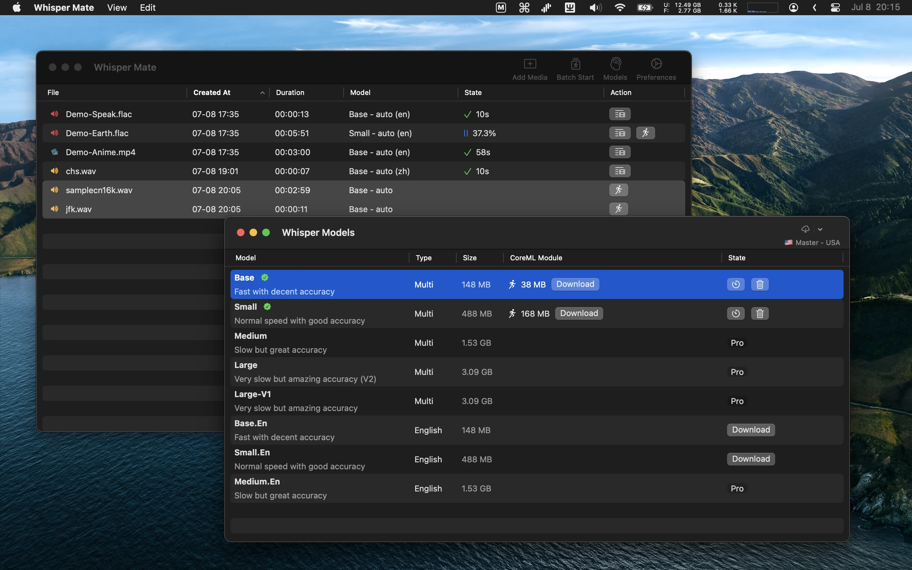

# 🎶 WhisperMate - Sử dụng mô hình Whisper AI để chuyển âm thanh thành văn bản với sự nhạy cảm địa phương!

[Tải về phiên bản mới nhất từ Mac App Store](https://apps.apple.com/pl/app/id6450404233).

## Tính năng
WhisperMate giúp chuyển đổi các file âm thanh và video thành văn bản bằng cách sử dụng mô hình Whisper AI. Bạn có thể sử dụng bất kỳ phần nào của ứng dụng để xem kết quả chuyển đổi thông qua trình chỉnh sửa văn bản tích hợp.
Tất cả quá trình chuyển đổi diễn ra trên thiết bị của bạn và đảm bảo tính riêng tư của dữ liệu của bạn.

V5.5.1
---
- Xin vui lòng sửa các lỗi dịch tự động sau khi hoàn tất dự án.
- [148 MB](https://download.marksdo.com/apps/WhisperMate/V5.5.1/WhisperMate.dmg) 

V5.5.0
---
- Thêm lựa chọn mô hình Deepgram nova-2.
- Thêm cài đặt độ trong suốt cho xử lý tiếng nói thời gian thực.
- Thêm cài đặt chỉ hiển thị kết quả dịch trong thời gian thực.
- Thêm cài đặt tùy chỉnh nền và màu chữ trong cửa sổ thời gian thực.
- Sửa lỗi khi cấu hình tự động không được áp dụng khi sử dụng mô hình Deepgram.
- Sửa lỗi khi cửa sổ cuộn thời gian thực không được giữ mở.
- [148 MB](https://download.marksdo.com/apps/WhisperMate/V5.5.0/WhisperMate.dmg) 

V5.4.9
---
- Thêm tính năng xuất các dự án mẫu theo lô, nó có thể xuất kết quả các dự án được chọn vào một tệp từ kịch bản mẫu
- Sửa các lỗi và cải thiện hiệu suất
- [148 MB](https://download.marksdo.com/apps/WhisperMate/V5.4.9/WhisperMate.dmg) 

V5.4.8
---
- Thêm cài đặt quyền riêng tư trong thanh trạng thái dưới cùng của cửa sổ chính, nó có thể vô hiệu hóa phân tích sự kiện và báo cáo lỗi và nhật ký cục bộ.
- Thêm ví dụ kịch bản để xóa các hàng tương tự nhau.
- Thêm ví dụ kịch bản để thay thế chuỗi phụ đề như '(Nhạc) * Nhạc * [Nhạc]' thành chuỗi rỗng.
- Thêm thuộc tính ghi lại .memo .markWarn .warnMsg.
- Thêm tùy chọn hiển thị trễ phụ đề trong công cụ xem trước.
- Thêm tùy chọn chỉnh sửa hàng loạt thời gian bắt đầu hoặc kết thúc phụ đề trong bộ công cụ chỉnh sửa phụ đề.
- Thêm phím tắt (⇧)+←→ trong trình chỉnh sửa phụ đề để nhanh chóng nhảy 5 giây hoặc 30 giây trong trình xem trước.
- Thêm thanh điều khiển loa và hỗ trợ thiết lập nhanh bằng phím tắt.
- Sửa lỗi không thể ẩn phụ đề trong trình xem trước.
- Sửa lỗi không thể cắt văn bản vào clipboard và không thể chọn bằng cách kéo trong trình soạn mẫu.
- Sửa lỗi định dạng thời gian của phạm vi .t0f5 .t0f4 .t0f2 trong mẫu tùy chỉnh vẫn trả về 3 chữ số số trong mili giây.
- [148 MB](https://download.marksdo.com/apps/WhisperMate/V5.4.8/WhisperMate.dmg) 

V5.4.7
---
- Thêm tùy chọn tự động bắt đầu dự án khi tệp được thêm vào danh sách dự án (chuyển đổi nằm ở thanh trạng thái dưới cùng của cửa sổ chính)  
- Thêm bước tự động xuất tệp vào thư mục tùy chỉnh  
- Thêm bước tự động gửi kết quả vào hộp thư của bạn (Nó có thể tự động sử dụng kết quả xuất tệp tự động trước đây như tệp đính kèm)  
- Nâng cấp trình chỉnh sửa mẫu và JavaScript để khắc phục các vấn đề về sự cố.
- [148 MB](https://download.marksdo.com/apps/WhisperMate/V5.4.7/WhisperMate.dmg) 

V5.4.6
---
- Thêm tùy chọn bố cục phụ đề xem trước phương tiện, đoạn trích nguồn và phụ đề dịch có thể điều khiển hiển thị lên hoặc xuống. 
- Thêm mô hình lõi v3 coreml lớn. 
- Thêm phím tắt ⌘+⌥+f hoặc nhấp đúp xem trước để chuyển nhanh sang chế độ toàn màn hình. 
- Một số phím tắt hiện đã hỗ trợ bấm một ký tự để thực hiện (ghép, chia, điều chỉnh). 
- Sau khi ghép phụ đề, bây giờ tự động chọn dòng ghép đầu tiên. 
- Hủy liên kết ứng dụng mặc định mở với whisper mate cho các tệp âm thanh và video. 
- Sửa một số lỗi gây sập ứng dụng trong phiên bản V5.4.5. 
- Sửa lỗi hiển thị thông báo. 
- Sửa một số vấn đề dịch.
- [123 MB](https://download.marksdo.com/apps/WhisperMate/V5.4.6/WhisperMate.zip) 

V5.4.5
---
- ❗Phiên bản Universal có thể cần phải tải lại. Do tôi nâng cấp thiết bị phát triển của mình và quên lưu lại Universal deployment EDKey.
- Thêm tính năng tự động để thực thi công việc khi dự án hoàn tất việc chuyển văn bản thành lời (ghép lại/Lưu ảnh chụp/Mã lệnh/Dịch).
- Thêm tùy chọn chuyển văn bản theo đoạn với độ dài tối đa.
- Thêm ví dụ câu hỏi mẫu cho mô hình.
- Thêm tùy chọn thay thế bằng ký tự '\\n' (một dấu gạch chéo với ký tự n) để xuống dòng mới trong tính năng thay thế.
- Nâng cấp giao diện cấu hình tùy chọn chuyển văn bản của dự án.
- [122 MB](https://download.marksdo.com/apps/WhisperMate/V5.4.5/WhisperMate.zip)

V5.4.4
---
- Thêm danh sách mô hình đám mây vào bảng cấu hình mô hình với hỗ trợ tải xuống từ 2 máy chủ. (Chuyển sang máy chủ 2 nếu không thể tải xuống từ máy chủ 1)   
- Hỗ trợ chuyển sang mô-đun CoreML nếu tắt tùy chọn tăng tốc GPU trong cài đặt chung  
- Sửa lỗi tải xuống mô hình lớn không thành công  
- Sửa lỗi sập ứng dụng trên các thiết bị không phải Apple Silicon.
- [122 MB](https://download.marksdo.com/apps/WhisperMate/V5.4.4/WhisperMate.zip) 

V5.4.3
---
- Cải thiện tốc độ ghi chép
- Thêm hỗ trợ mô hình lớn whisper v3
- Thêm hỗ trợ máy dịch LibreTranslator
- Thêm chức năng nhân bản dự án trong menu ngữ cảnh của dự án
- Cập nhật trường người nói có thể nhập trực tiếp trong chế độ chỉnh sửa (⌘+E)
- Sửa lỗi cửa sổ có nhiều tab vượt quá 2 gây gửi tín hiệu bị lỗi
- Sửa lỗi giao diện xem sóng âm gặp lỗi khiến chương trình đôi khi bị treo
- Sửa lỗi không thể dịch các dòng đã chọn trong trình chỉnh sửa phụ đề

V5.4.2
---
- Thêm tùy chọn đếm số luồng xử lý tiếng thìs trong cấu hình. (Sử dụng ít luồng để tiện cho việc máy tính làm công việc khác, nhưng thời gian xử lý sẽ tăng)
- Thêm hỗ trợ công cụ trình diễn Deepgram, cũng như hỗ trợ chế độ trình diễn luồng thời gian thực.
- Thêm ví dụ mẫu để xuất nội dung phát biểu của người nói tự động.
- Thêm từ khóa bắt đầu bằng @ để lọc các dòng nói của người nói hoặc thay thế tất cả tên người nói bằng tên khác (vd: @tom-->jack).
- Thêm tính năng lưu cấu hình người phát biểu mới nhất của dự án và sử dụng lại trong dự án mới.
- Xuất mẫu tùy chỉnh thêm hỗ trợ 9 mẫu tùy chỉnh hiện tại.

V5.4.1
---
- Thêm tính năng quản lý từ xa qua mạng nội bộ, sử dụng điện thoại hoặc thiết bị khác để thêm tệp tin để xử lý và xem trạng thái xử lý (ở thanh trạng thái phía dưới cửa sổ chính).
- Thêm bộ chọn mẫu cấu hình tham số trí tuệ nhân tạo.
- Thêm tham số trí tuệ nhân tạo để không hiển thị dấu câu.
- Thêm javascript để sử dụng yêu cầu http đồng bộ để lấy hoặc gửi dữ liệu (Bạn có thể sử dụng nó để gửi dữ liệu hàng dòng phụ đề của bạn đến dịch vụ llm cục bộ để nhận kết quả sửa đổi sau đó điền trở lại cho phụ đề gốc, hoặc gửi đến dịch vụ hệ thống http/https khác, tải ví dụ http từ trình xử lý javascript để xem cách sử dụng nó).
- Sửa lỗi tiếng ồn khi đường dẫn tệp tin chứa ký tự khoảng trắng.

V5.4
---
- Thêm tính năng cắt nhanh  
- Thêm phím tắt (c) để hiển thị hoặc ẩn trình phát xem trước biên tập phụ đề 
- Thêm phím tắt để thay đổi tốc độ trình phát xem trước biên tập phụ đề 
- Thay đổi chiến lược không âm thành chiến lược theo phần  
- Sửa lỗi tùy chọn làm tĩnh nhiễu

### Tính năng cắt nhanh mới có các chức năng sau:
- Hiển thị dạng sóng âm thanh để xác định chính xác vị trí và cắt video.
- Chia nhỏ các tệp phương tiện dài thành nhiều đoạn riêng biệt để xử lý riêng trước khi chuyển đổi thành văn bản.
- Sử dụng chiến lược theo phần để bỏ qua các đoạn không có âm thanh hoặc không thể chuyển đổi thành văn bản.
- Cắt riêng các đoạn cần chuyển đổi thành văn bản thành các tệp tin riêng biệt.

V5.3.1
---
- Thêm thuộc tính ưu tiên dự án trong hàng đợi xử lý hàng loạt, ưu tiên cao sẽ được xử lý trước (tùy chọn được đặt trong menu ngữ cảnh)
- Chức năng thay thế văn bản phụ đề cũng thay thế từ khóa phù hợp trong văn bản đã dịch
- Sửa lỗi tái chữa với chiến lược bỏ qua âm thô và giảm các vấn đề về tiếng ồn

V5.3
---
- Thêm nhiều mô hình với độ chính xác cao hơn cho các ngôn ngữ
- Thêm chiến lược chuyển đổi để bỏ qua đoạn im lặng (được phân loại bằng cường độ âm thanh và thời lượng im lặng)
- Thêm tùy chọn để giảm tiếng ồn nền.
- Thêm tùy chọn để làm cho phụ đề hiển thị trước dấu thời gian (không tiết lộ nội dung chính) trong quá trình chuyển đổi.
- Thêm ví dụ về xử lý JavaScript để viết hoa chữ cái đầu của đoạn phụ đề.

V5.2
---
- Thêm các mô hình được điều chỉnh tinh chỉnh cho ràng buộc ngôn ngữ khác nhau. cantonese/zh/ko/jp/de/fr/th/uk...
- Thêm tính năng để thêm mô hình AI Whisper cục bộ vào Whisper Mate.
- Thêm tính năng để thiết lập cấu hình các tham số mô hình dự án theo lô.
- Thêm tùy chọn để ngăn chế việc bắt đầu màn hình chờ khi có hàng đợi đang chạy.
- Sửa lỗi khi màn hình chờ hệ thống được bật, nhiệm vụ xử lý bị tạm dừng.
- Sửa lỗi khi nhấp vào dòng chỉnh sửa phụ đề, đôi khi không thể điều hướng đến vị trí của người phát trên trình phát.
- Sửa lỗi hoàn tác và làm lại văn bản đã được chỉnh sửa trong trình duyệt menu ngữ cảnh không hoạt động.
- Sửa lỗi xuất vụ trình phụ đề khi kết hợp không khớp dải thời gian.

V5.1
---
- Thêm tính năng xuất dự án theo lô với tùy chọn kết hợp vào một tệp 
- Thêm tính năng ghi âm lại các dòng được chọn với các thông số AI khác nhau 
- Thêm tính năng hoàn tác hoặc làm lại thay đổi văn bản trong nội dung văn bản phụ đề với thay đổi gõ tay (phím tắt ⌘ + Z để hoàn tác / ⌘ + ⇧ + Z để làm lại) 
- Thêm tính năng thêm hàng phụ đề mới trống phía dưới hàng đang được chọn (phím tắt ⌘ + N) 
- Thêm tính năng thông báo hoàn thành dự án qua webhook đến Slack (bạn có thể nhận được thông báo trên điện thoại khi mỗi dự án ghi âm xong) 
- Sửa vị trí hộp điều khiển chơi phương tiện không căn giữa khi ở trong bố cục kiểu lên xuống

V5.0
---
- Thêm công cụ để tự động ghép phụ đề trong các đoạn đoạn liên tiếp
- Thêm bộ xử lý tùy chỉnh để điều chỉnh phụ đề đã chuyển thành văn bản theo lô
- Thêm tính năng điều chỉnh trình soạn phụ đề. Tương tự như tính năng chia & ghép, nó có thể chọn nhiều hàng cùng một lúc và điều chỉnh chúng trong một dòng văn bản
- Thêm trình soạn phụ đề với hỗ trợ phím tắt hơn
- Thêm phông chữ tùy chỉnh vào bảng cấu hình kiểu phụ đề xem trước video
- Thêm phông chữ tùy chỉnh vào bảng cấu hình kiểu phụ đề cố định trên video gốc
- Thêm hỗ trợ xuất ra định dạng pdf hoặc docx, chỉ cần đề xuất hậu tố là pdf hoặc docx
- Thêm ví dụ về định dạng xuất mẫu. Bạn có thể tải ví dụ và điều chỉnh cho kết quả mẫu
- Thêm tính năng chụp ảnh của tình trạng phụ đề hiện tại trong dự án. Sau đó, dễ dàng phục hồi lại các tình trạng đã lưu
- Thêm tính năng nhập .srt vào dự án hiện tại như là tình trạng lưu
- Thêm tùy chọn để thiết lập hiển thị phụ đề video xem trước bằng văn bản dịch
- Thêm chức năng xuất tùy chỉnh. Số ngẫu nhiên và GUID ngẫu nhiên và phần tử escXML và thay thế chuỗi với định dạng tùy chỉnh
- Thêm tùy chọn đầu ra xuất tùy chỉnh (tệp hoặc clipboard)
- Thêm tùy chọn xuất tất cả phụ đề hoặc chỉ phụ đề đã chọn
- Thêm nhóm cửa sổ trình soạn dự án với tùy chọn cửa sổ chính
- Thêm cấu hình tham số xử lý mô hình vừa chớp mắt bổ sung trong bộ chọn mô hình (góc dưới bên phải), có thể không dễ tìm thấy vì hầu hết không cần chỉnh sửa các tham số này
- Tối ưu hóa hành vi xem toàn màn hình của video xem trước
- Hỗ trợ từ khóa tìm kiếm hoặc điều kiện (sử dụng | làm từ khóa hoặc. ví dụ "hi|hello|hey")
- Tối ưu hóa logic tìm kiếm và thay thế. Khi thay thế được thực hiện, tìm kiếm từ khóa sẽ được điều chỉnh để hiển thị từ khóa nguồn và từ khóa đã thay thế
- Tối ưu hóa logic chuyển thành văn bản theo luồng thời gian thực
- Sửa lỗi một số cửa sổ con không đưa ra bên trước
- Sửa lỗi định dạng xuất xml
- Sửa lỗi một số phê duyệt phương tiện trích xuất wav không thành công
- Sửa lỗi rời khỏi trường từ khóa thay thế sẽ tự động thay thế

V4.0
---
- Thêm tính năng nhớ thuộc tính bố cục trình soạn phụ đề của dự án. Mỗi dự án có thể sử dụng cấu trúc và kích thước trình phát xem trước khác nhau. (dự án cũ phải mở lại sau đó mới ghi nhớ được thuộc tính bố cục)
- Thêm tùy chọn tìm kiếm phụ đề trùng trong trình soạn
- Thêm tùy chọn menu ngữ cảnh để mở trình soạn ngay cả khi kịch bản chuyển hàng loạt chưa bắt đầu
- Thêm khả năng xuất phụ đề sang định dạng .sbv
- Thêm tính năng mẫu xuất tùy chỉnh (như .fcpxml, .itt, .ttml)
- Thêm plugin mới
- Thêm tùy chọn cấu hình từ khoá sử dụng thường xuyên và thay thế nhanh
- Thêm cờ đánh dấu mục ở góc màn hình xem trước của trình chạy
- Thêm tùy chọn đánh dấu trong menu ngữ cảnh trình soạn phụ đề
- Thêm tính năng chia hàng trong trình soạn phụ đề khi chọn một hàng duy nhất
- Thêm tìm kiếm kết quả hiển thị tên dự án trong hàng
- Thêm hiển thị thông tin lỗi khi tiến trình truyền đa phương tiện gặp lỗi
- Thêm tùy chọn ẩn nút hàng để định vị của trình soạn
- Thêm tắt nhanh ⌘+S để xuất nhanh .srt ra tệp
- Sửa lỗi thông tin meta âm thanh kênh truyền phương tiện nhận hai kênh âm thanh nhưng thực tế chỉ có một. (thêm tùy chọn bỏ qua việc chọn kênh âm thanh)
- Sửa lỗi không thể cháy phụ đề khi tên dự án đã được thay đổi thủ công
- Sửa lỗi giao diện người dùng trên macOS12
- Sửa lỗi không khóa tùy chọn hiển thị thanh trạng thái

V3.5
---
- Thêm tính năng tải xuống âm thanh của phụ đề. Bây giờ bạn có thể chọn bất kỳ phụ đề nào sau đó sử dụng menu ngữ cảnh để tải xuống âm thanh, khi chọn nhiều hàng, nó sẽ tự động ghép thành một đoạn. âm thanh.
- Thêm kiểu cửa sổ nhỏ cho việc ghi âm trực tiếp
- Thêm tùy chọn menu ngữ cảnh thanh menu trình chiếu video
- Thêm phát nhanh đoạn chạy audio đoạn trong kết quả tìm kiếm toàn cầu hoặc tải trực tiếp đoạn audio kết quả tìm kiếm
- Thêm hỗ trợ tải mô hình
- Thêm tính năng ghi nhớ, bây giờ bạn có thể thêm ghi chú cho bất kỳ phụ đề nào trong trình soạn
- Thêm tùy chọn dịch Azure
- Thêm tìm kiếm phụ đề toàn cầu trong tất cả các dự án
- Thêm từ khóa tìm kiếm được làm nổi bật trong kết quả tìm kiếm
- Thêm phím tắt mặc định cho kiểm soát nhanh của cửa sổ như Đóng/Phóng to/Thu nhỏ
- Thêm tùy chọn ẩn nhãn thanh công cụ chính
- Chuyển nút bắt đầu hàng loạt từ thanh công cụ chính sang menu ngữ cảnh
- Sửa lỗi replace không thể thay thế bằng chuỗi trống
- Sửa lỗi mất mô hình nhỏ và tiếng Anh trong các máy chủ dự phòng
- Sửa lỗi vị trí thanh trượt phụ đề của trình phát tệp âm thanh đã ghi lại

V3.0
---
- Thêm xuất phạm vi phương tiện phụ đề đã chọn sang tệp phương tiện mới
- Thêm xuất video với phụ đề cố định gốc và kiểu phụ đề tùy chỉnh
- Thêm xem trước trực tiếp phụ đề trong xem trước video (kiểu phụ đề có thể được tùy chỉnh trong bảng các tùy chọn)
- Thêm ghi âm âm thanh từ microphone và hỗ trợ chuyển thành văn bản theo thời gian thực (chỉ trên macOS13.0+)
- Thêm tính năng ghép phụ đề. Phạm vi đoạn & phụ đề sẽ được ghép thành một hàng
- Thêm lưu tệp âm thanh từ ứng dụng ghi âm và tự động lưu thành dự án chuyển thành văn bản mới
- Thêm tùy chọn để nhân bản hàng phụ đề và cho phép chỉnh sửa nội dung hoặc phạm vi thời gian để điều chỉnh phạm vi phụ đề đầy đủ
- Thêm tùy chọn Kích hoạt whisper nhúng để chuyển sang tiếng Anh trong bảng cấu hình mô hình dự án
- Thêm tùy chọn sử dụng cấu hình thông báo nhúng whisper trong bảng cấu hình mô hình dự án
- Thêm tùy chọn vô hiệu hóa cuộn hàng phụ đề tự động khi xem trước video
- Thêm hỗ trợ xem trước phương tiện tốc độ phát lại tùy chỉnh
- Thêm hỗ trợ ⌘+V để dán các tệp đã sao chép vào hàng đợi xử lý
- Thêm chuyển đổi nhanh sang chế độ chỉnh sửa. Tất cả phụ đề có thể chỉnh sửa hoặc xem bằng phím tắt (⌘+E)
- Thêm hiển thị phần trăm sử dụng CPU khi xử lý whisper
- Thêm hỗ trợ lưu các dự án vào lưu trữ bằng menu ngữ cảnh (giữ danh sách dự án làm việc sạch)
- Thêm dịch Google trong kiểm soát dịch phụ đề
- Thêm hỗ trợ nhiều ngôn ngữ ứng dụng hơn
- Thêm trình xem trước phương tiện kích thước đầy đủ với bố cục phụ đề
- Thêm hỗ trợ mở tệp phương tiện trong các tính năng mở với của trình tổ chức
- Tối ưu hóa tốc độ hiển thị hàng dữ liệu lớn trong trình soạn phụ đề
- Sửa lỗi chọn nhiều kênh âm thanh trong video
- Sửa lỗi nhảy phụ đề trình xem trước và điều hướng thanh trượt video

V2.0
---
- Hỗ trợ thu âm và chuyển thành văn bản âm thanh trong các ứng dụng khác như (Zoom/Skype/Teams/Meetings App, Chỉ trên macOS13.0+)
- Thêm plugin để chuyển đổi phụ đề tiếng Trung đơn giản thành tiếng Trung phồn thể hoặc ngược lại. (Cần kích hoạt plugin đầu tiên trong bảng tùy chọn)
- Sửa lỗi trình soạn dự án không thể sử dụng phím tắt để phát hoặc dừng phương tiện
- Sửa lỗi định dạng xuất SRT và VTT
                                              
V1.0
---
- Chuyển âm thanh hoặc video thành văn bản
- Sử dụng API miễn phí của Deepl để dịch phụ đề
- Nhúng trình soạn phụ đề để sửa chữa bản chú giải
- Xuất ra định dạng SRT, VTT, CSV, JSON, SEGMENT
- Hỗ trợ đặt người nói cho mỗi phụ đề
- Hầu hết các hoạt động hỗ trợ chọn theo lô để kích hoạt. Giống như chạy tác vụ hàng loạt. hàng loạt dịch hàng, thiết lập người nói hàng loạt
- Hỗ trợ kéo và thả tệp để bắt đầu chuyển thành văn bản
- Hỗ trợ gõ trên bộ chuyển đổi bản dịch
- Trình soạn có thể xem trước âm thanh hoặc video đồng bộ khoảng phát
- Hỗ trợ chuyển đổi nhiều ngôn ngữ
- Hỗ trợ ngôn ngữ tùy chỉnh thường xuyên sử dụng để chuyển đổi hoặc dịch

Đặc điểm

- Chuyển đổi tập tin âm thanh và video thành văn bản
- Ghi âm và chuyển đổi cuộc trò chuyện từ Zoom / Skype / Teams / các chương trình khác (yêu cầu phiên bản macOS 13.0 trở lên)
- Dịch miễn phí bằng API DeepL
- Các công cụ chỉnh sửa phụ đề tích hợp trong phần mềm
- Xuất dạng tập tin SRT, VTT, CSV, JSON, SEGMENT
- Lựa chọn tên cho phụ đề phụ thuộc
- Hỗ trợ nhiều chức năng cùng lúc, chẳng hạn như chuyển đổi lô hoặc làm việc nhóm và phân tích
- Hỗ trợ kéo và thả các tập tin để chuyển đổi phụ đề
- Xem lại các phụ đề trong quá trình nhập liệu
- Phát lại tệp âm thanh hoặc video mẫu trong trình chỉnh sửa
- Xuất phụ đề được chọn làm tệp phương tiện mới
- Thêm phụ đề vào video gốc với kiểu đã xác định trước hoặc do người dùng xác định
- Xem trước phụ đề ngay trong cửa sổ xem trước (có thể tùy chỉnh trong cài đặt phụ đề)
- Chuyển đổi văn bản thành giọng nói trực tiếp trong quá trình ghi âm (chỉ dành cho phiên bản macOS 13 trở lên)
- Kết hợp các phần phụ đề - kết hợp khoảng thời gian và văn bản thành một dòng
- Tự động lưu dự án và khả năng chuyển đổi nó thành một dự án mới
- Sao chép hoặc thay đổi thời gian của dòng phụ đề
- Cấu hình phát đối với bài thuyết trình hình ảnh
- Sử dụng menu nhanh để chèn tệp vào hàng đợi bằng cách nhấn tổ hợp phím Cmd + V
- Hiển thị trạng thái sử dụng CPU trong quá trình chỉnh sửa âm thanh
- Hỗ trợ tạo tập tin tắt (để làm sạch danh sách sử dụng)
- Hỗ trợ dịch văn bản bằng Google Translate
- Hiển thị phụ đề toàn màn hình khi phát lại phương tiện
- Mở phương tiện bằng menu nhanh
- Hỗ trợ dịch trong nhiều ngôn ngữ hoặc các ngôn ngữ phổ biến

