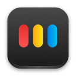
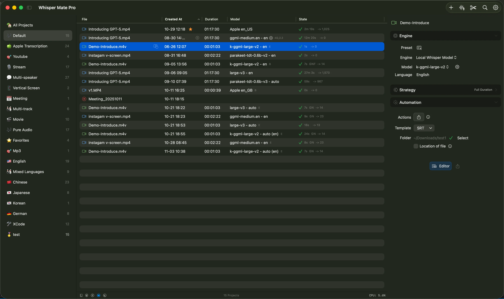
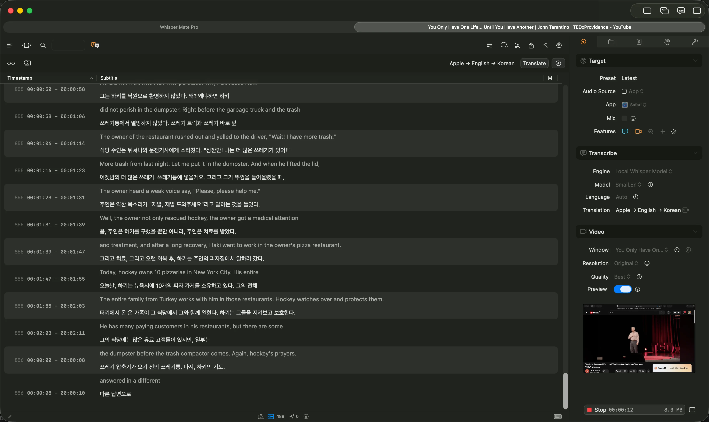
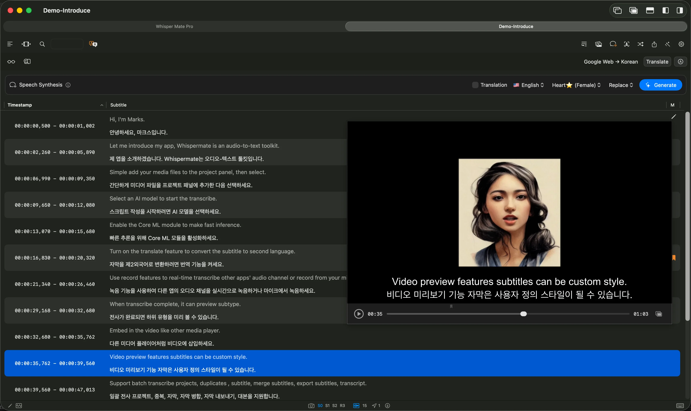
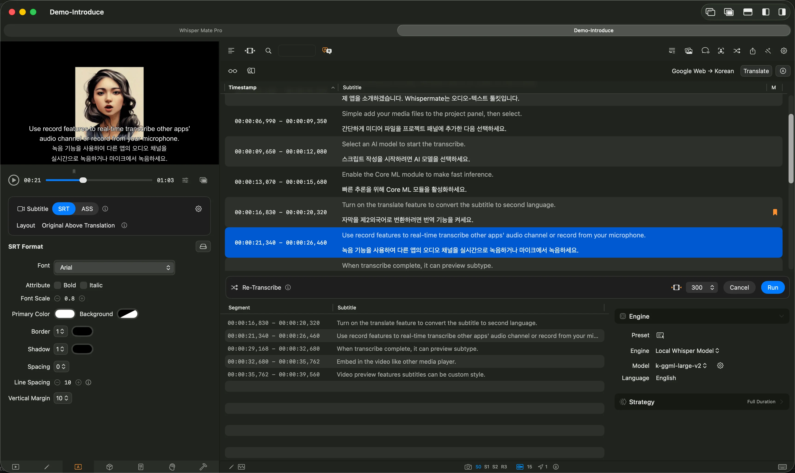
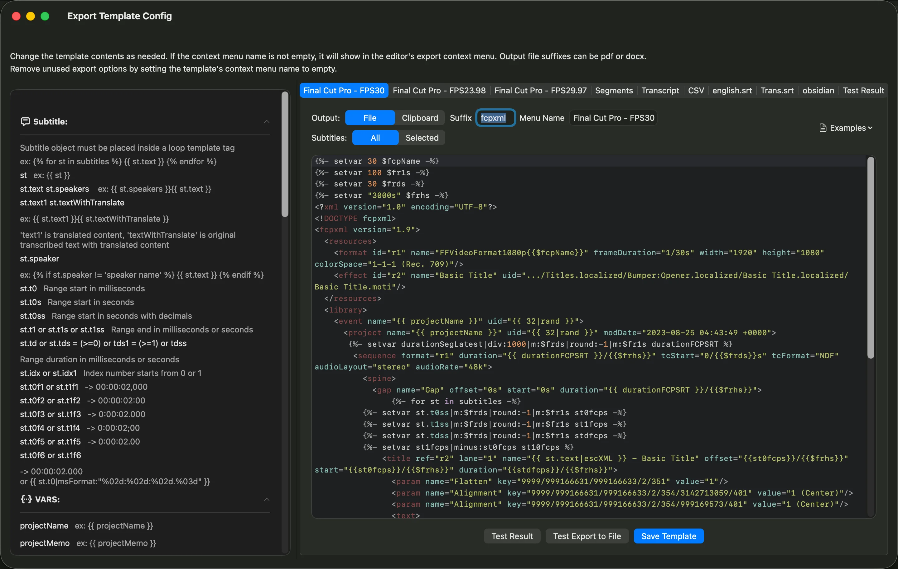
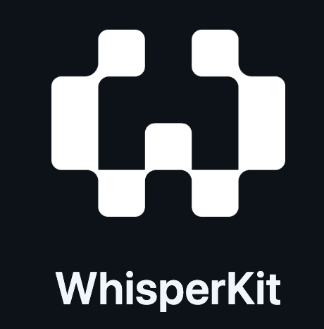

# 🎶 Whisper Mate – Lokal arbetsyta för undertexter och tal
[Deutsch](README.de.md) · [English](../README.md) · [Spanish](README.es.md) · [Finnish](README.fi.md) · [French](README.fr.md) · [Italian](README.it.md) · [Indonesian](README.id.md) · [언어](README.ko.md) · [日本語](README.ja.md) · [简体中文](README.zh_cn.md) · [繁体中文](README.zh_tw.md) · [Norwegian](README.nb.md) · [Dutch](README.nl.md) · [Polish](README.pl.md) · [Portuguese](README.pt_PT.md) · [Swedish](README.sv.md) · [ภาษาไทย](README.th.md) · [Turkish](README.tr.md) · [Ukrainian](README.uk.md) · [Vietnamese](README.vi.md)

|  | Whisper Mate omvandlar ljud och video till finslipade undertexter, översättningar och exporter – allt bearbetas lokalt på din Mac så att varje projekt förblir privat. Ladda ned från macOS App Store: [Whisper Mate](https://apps.apple.com/us/app/id6450404233) |
| --- | --- |

## 🔑 Viktiga fördelar
- **Integrerat integritetsskydd**: Transkribering, översättning och export sker helt lokalt; känsligt innehåll lämnar aldrig din Mac.
- **Välj bästa motorn**: Växla mellan FluidAudio, whisper.cpp, WhisperKit, Apples lokala AI (macOS 26+) och Kokoro English Speech Synthesis för voice-over.
- **Arbetsflöde för liveproduktion**: Övervaka inspelningar, undertexter, översättningar, flytande förhandsvisningar och automationskedjor i realtid.
- **Förhandsvisning som matchar slutresultatet**: Granska typografi, teckenstorlek och radavstånd direkt i den inbyggda spelaren.
- **Utbyggbara verktyg**: Kombinera mallar, JavaScript-processorer, ordböcker och regex-transformer för att automatisera komplex efterbearbetning.
- **Specialiserad undertextstation**: Hantera redigering, granskning, batch-export/import samt Final Cut Pro-, QuickLook-, GIF- och MKV-flöden på ett ställe.

## 🔥 Kärnkapacitet
- **Batch- och live-transkribering**: Hantera stora mängder media, live-mikrofoninspelning, app-ljudroutning och simultan översättning.
- **Undertext- och översättningseditor**: Slå ihop, dela, justera timing, Quick-Cut, massersättningar och fullständiga tangentbordsgenvägar.
- **Flerspråkig översättning**: Utnyttja DeepL, Apple Translate, GPT, Gemini, DeepSeek, OpenRouter eller lokala Ollama-kompatibla LLM:er.
- **Automationsplaybooks**: Kör skript, exporter, sammanfattningar eller aviseringar automatiskt när jobb slutförs.
- **Import-/exportekosystem**: Arbeta sömlöst med SRT, VTT, ASS, FCPXML, GIF, PDF, DOCX, MKV, ljudklipp och mer.
- **Visuella verktyg**: Flytande fönster, anpassningsbara typsnitt och radavstånd, textläge eller delad vy med ett klick.
- **LLM-samarbete**: Koppla Apples lokala modeller, Ollama eller fjärr-LLM:er för polering, sammanfattningar eller skriptfixar.
- **Projektkontroll & snapshots**: Gruppera projekt, prioritera köer, skapa återställningsbara snapshots, arkivera säkert och övervaka fjärrmappar.
- **Videopostproduktion**: Quick Cut-vågformsredigering, kapitel, scen-keyframes, GIF/MP4-export och hard-sub-kodning.

## 🚀 Användningsområden
- Undertextning, översättning och voice-over för film, podcast och intervjuer.
- Realtidsanteckningar och sammanfattningar för möten, kurser eller livesändningar.
- Medieteam som bearbetar flerspråkiga batchar med helautomatisk pipeline.
- Akademiska eller forskningsgrupper som arkiverar och annoterar talcorpus med snapshots.
- Marknads- och socialteam som återanvänder långformatvideo till shorts, GIF:ar eller berättarröster.
- Kundsupport-, sälj- eller juridikinspelningar som kräver efterlevnad och revisionsspår av hög kvalitet.

## 📋 Avancerad resursguide
- [FAQ & tips](../docs/faq-and-tips.md)
- [Anpassade exportmallar](../docs/custom-export-templates.md)
- [LLM-integrationer (sammanfattning, QA, fixar)](../docs/llm-integrations.md)
- [Export av videor med undertexter](../docs/exporting-subtitled-videos.md)
- [Katalogövervakning & auto-transkribering](../docs/directory-monitoring.md)
- [Transkribering i realtid](../docs/real-time-transcription.md)
- [Omtranskribering av segment](../docs/segment-retranscription.md)
- [Hantera presets](../docs/preset-management.md)
- [Ordboksarbetsflöden](../docs/dictionary-workflows.md)
- [Snapshot best practices](../docs/snapshot-best-practices.md)
- [Multi-projekthantering & sökning](../docs/multi-project-management.md)
- [Exempel på helt automatiserade arbetsflöden](../docs/fully-automated-workflows.md)

## 💬 Support & feedback
- Skicka feedback via **About**-menyn i appen eller öppna ett issue på GitHub så kan vi följa framstegen tillsammans.

## 🏞️ App-skärmar

## 🔋 Tack till dessa fantastiska open source-projekt

- 
- 
- 

  
  
  

