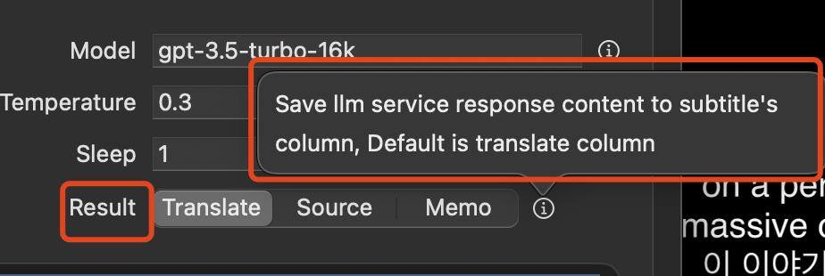

# Translate using chatGPT
it also can use other llm model (use litellm to proxy it to chatGPT formate)
https://github.com/BerriAI/litellm

## Use template to ask gpt


## instructions also support use template replace vars


example instructions code

```
You are an expert in English-Korean translation and need to translate a text that has been transcribed from speech. I will provide you with the full transcription for reference. Please provide better adaptability in translating the information based on the content of the full transcription. You only need to reply with the translated content. 
Here is the full transcription:


{{ st.text }}


```

you can use your language to custom the gpt instructions and templates

## Use in subtitle editor


## instructions & template script examples
it use the sample template engine use in custom export template feature, so more vars can found in template config


### loop subtitle
```

{{ st.text }}

```

### current active subtitle row origin text
```
{{ st.text }}
```

...

## Test gpt 


### test - Hello world
just test is connect gpt success

### test - template
use current project and selected subtitle row to test template result.


## GPT Result



when result write to source column, if result is difference with origin source text, the origin source will save backup to memo column, and make column an changed mark.
